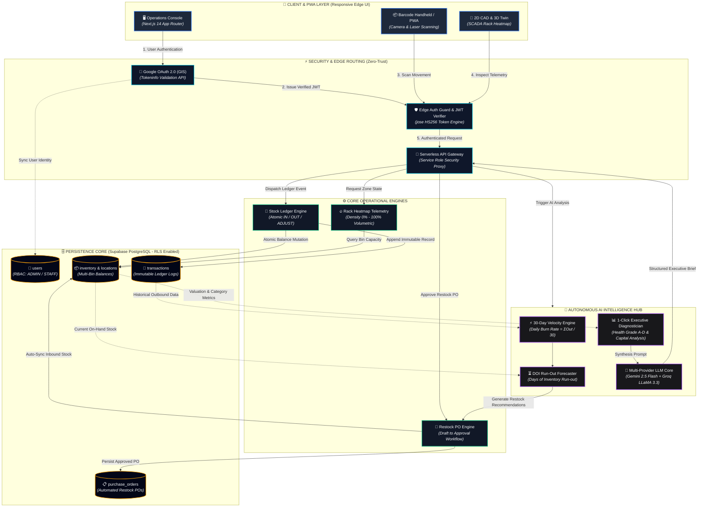
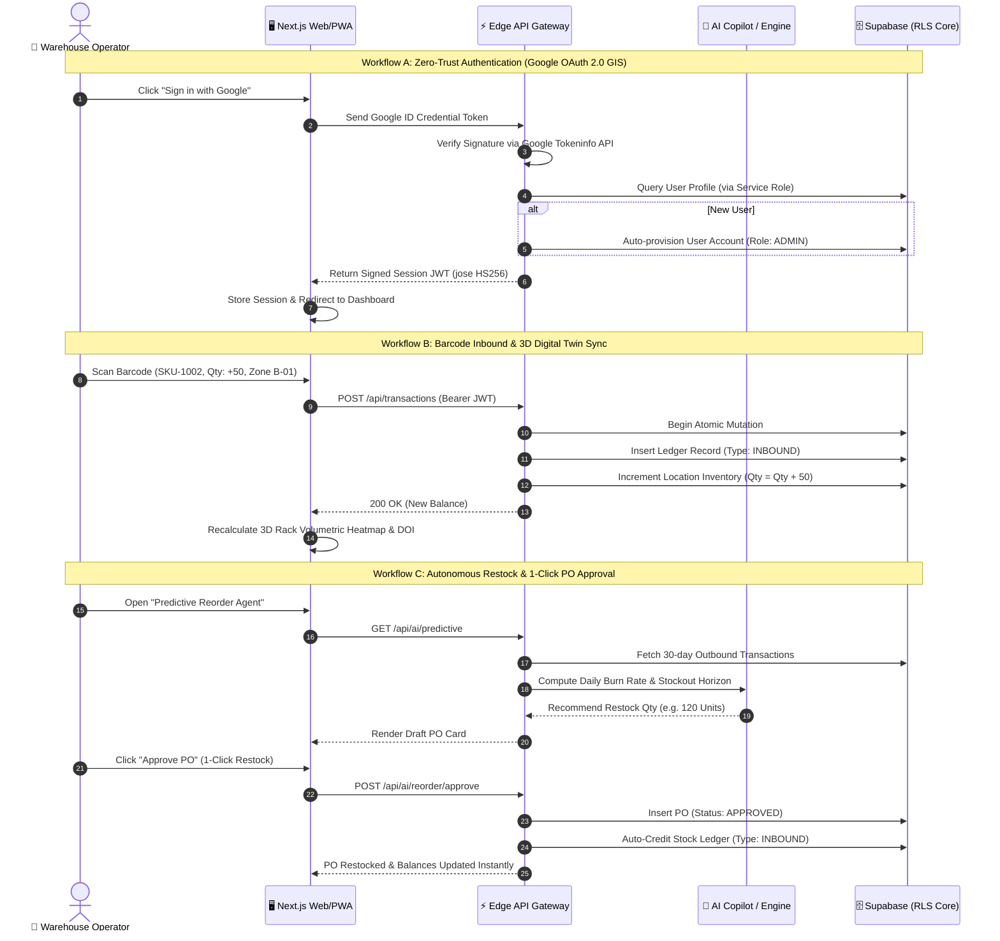
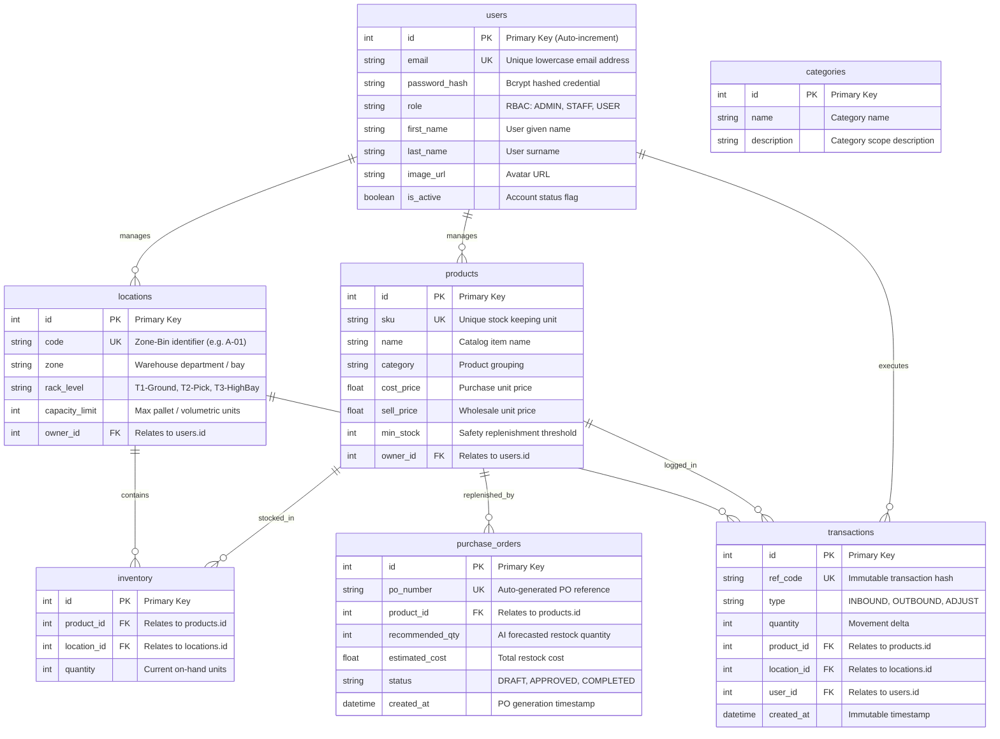

# OptiTrack WMS

> **Enterprise-Grade Intelligent Warehouse Management System (WMS) & Digital Twin**

[](https://optitrack-wms.vercel.app)
[](https://github.com/ZillerDX/Optitrack-WMS/actions/workflows/ci.yml)
[](https://nextjs.org/)
[](https://supabase.com/)
[](https://fastapi.tiangolo.com/)
[](https://www.typescriptlang.org/)
[](https://eslint.org/)

👉 **Production Live Application**: [https://optitrack-wms.vercel.app](https://optitrack-wms.vercel.app)

---

## 📑 Table of Contents

1. [Product Pillars (Who / Problem / Solution)](#-1-product-pillars-who--problem--solution)
2. [Core Capabilities & Features](#-2-core-capabilities--features)
3. [Enterprise System Architecture](#-3-enterprise-system-architecture)
4. [Operational Swimlane Workflows](#-4-operational-swimlane-workflows)
5. [Database Entity Relationship Diagram (ERD)](#-5-database-entity-relationship-diagram-erd)
6. [Interactive API Specification](#-6-interactive-api-specification)
7. [Security Hardening & 5 Quality Gates Audit](#-7-security-hardening--5-quality-gates-audit)
8. [Technology Stack](#-8-technology-stack)
9. [Annotated Project Structure](#-9-annotated-project-structure)
10. [Local Development & Deployment](#-10-local-development--deployment)

---

## 🎯 1. Product Pillars (Who / Problem / Solution)

```
                  ┌──────────────────────────────────────────────────────────┐
                  │                 OptiTrack WMS Ecosystem                  │
                  └────────────────────────────┬─────────────────────────────┘
                                               │
               ┌───────────────────────────────┼───────────────────────────────┐
               ▼                               ▼                               ▼
     🏢 SCADA Digital Twin          🤖 Autonomous AI Copilot        🔒 Zero-Trust Core
     2D CAD & 3D Isometric          DOI Forecasting & 1-Click PO    Supabase RLS & Google GIS
```

### Who: Target Audience & Personas
- **Warehouse Floor Operators**: Need rapid barcode scanning, instant bin destination routing, and mobile PWA responsiveness without UI lag.
- **Inventory & Logistics Controllers**: Need real-time multi-location stock visibility, immutable transaction audit logs, and spatial rack density heatmaps.
- **Procurement & Supply Chain Officers**: Need early warnings before stockout occurs, automated replenishment quantity calculations, and 1-click PO creation.
- **Chief Operations Officers (COO) & Executives**: Need automated operational readiness evaluations (Grade A–D), tied-up capital analysis, and macro warehouse capacity metrics.

### Problem: Real-World Inefficiencies & Technical Gaps
1. **The Spatial Blindspot**: Traditional WMS platforms show tabular stock numbers but fail to visualize vertical high-bay rack density, causing pick-face bottlenecks and fragmented empty space.
2. **Reactive Stockout Disasters**: Procurement teams discover depleted inventory *after* orders fail, because static safety thresholds cannot account for velocity spikes ($V = \sum \text{Outbound} / 30$).
3. **Ledger Discrepancies & Concurrency Drift**: Legacy spreadsheets or unconstrained databases suffer race conditions, unverified public access, and string-coerced balance errors.
4. **Scattered Multi-Tool Fatigue**: Disjointed software for barcode generation, currency conversions, analytics, and purchasing creates slow handoffs and human error.

### Solution: The OptiTrack Advantage
**OptiTrack WMS** delivers a unified, industrial-grade operational cockpit:
- **Real-Time Digital Twin**: 2D CAD Blueprint and 3D Isometric SCADA perspectives with dynamic volumetric rack density ($0\%$ Empty to $>90\%$ Critical).
- **Autonomous Predictive AI Agent**: Continuous 30-day burn-rate analysis and Days of Inventory (DOI) forecaster generating automated Draft POs with 1-click restock approval.
- **Zero-Trust Enterprise Security**: Supabase PostgreSQL locked with Row-Level Security (RLS); direct public client queries denied, all mutations proxied through authenticated backend edge APIs.
- **PWA & Multi-Currency Engine**: Offline-ready progressive web app with vector barcode generation and real-time USD, THB, EUR, and JPY valuations.

---

## 🚀 2. Core Capabilities & Features

### 🏢 Interactive 2D / 3D SCADA Digital Twin
- **Bimodal Floorplan Views**: Switch dynamically between architectural **2D CAD Blueprint** mode (overhead spatial bin layout) and **3D Isometric Projection** mode (industrial pallet racks).
- **Multi-Tier Rack Inspection**: Inspect 3-tier industrial shelving:
  - **T1**: Ground Heavy Pallet Level
  - **T2**: Pick-Level Fast Movers
  - **T3**: High-Bay Overstock Storage
- **Live Volumetric Density Heatmaps**: Visual color-graded occupancy states with instant drill-down drawer showing SKU balances, expiration alerts, and direct inbound actions.

### 🤖 Autonomous AI Predictive Restock & 1-Click PO
- **Velocity Engine**: Computes daily run-rate ($V = \sum_{i=1}^{30} \text{Outbound}_i / 30$).
- **Days of Inventory (DOI) Forecaster**: Flags critical SKUs running out within 7 days ($DOI = \text{Stock} / V$).
- **1-Click Purchase Order Restock Workflow**:
  - Automatically calculates optimal replenishment batch size.
  - Operator reviews draft PO card and clicks **"Approve PO"**.
  - Atomically writes PO ledger, records `INBOUND` stock transactions, and updates bin balances in one transaction.

### 📊 1-Click AI Executive Operations Diagnostic Report
- **5-Point Strategic Diagnostic Brief**: Synthesizes macro warehouse telemetry into a C-level briefing:
  1. **Operational Readiness Score** (Grade A through D with percentage benchmark).
  2. **Working Capital Exposure** (Tied-up inventory valuation vs gross liquidation value).
  3. **Zone Capacity & Bottleneck Headroom** (High-bay vs pick-face congestion).
  4. **Urgent Fast-Mover Replenishment Needs**.
  5. **Prioritized Strategic Action Playbook**.

### 🔑 Google OAuth 2.0 & Zero-Trust RLS Architecture
- **Google Identity Services (GIS)**: One-tap authentication with server-side token validation and English UI enforcement (`?hl=en`).
- **PostgreSQL Row-Level Security (RLS)**: Public `anon` role completely revoked; zero client-side direct database exposure. All mutations flow through signed JWT session guards.

---

## 🌊 3. Enterprise System Architecture

The following diagram illustrates the complete topology across client interfaces, security edge routing, operational services, persistent storage, and the autonomous AI hub:



---

## 🔄 4. Operational Swimlane Workflows



---

## 🗄️ 5. Database Entity Relationship Diagram (ERD)



---

## 📡 6. Interactive API Specification

| Method | Endpoint | Description | Auth Required | Runtime |
|---|---|---|:---:|:---:|
| `POST` | `/api/auth/login` | Authenticate user via email/password & issue JWT | No | `force-dynamic` |
| `POST` | `/api/auth/google` | Verify Google GIS ID token & auto-provision user | No | `force-dynamic` |
| `POST` | `/api/auth/register` | Register new organization admin account | No | `force-dynamic` |
| `GET` | `/api/auth/me` | Fetch authenticated user profile | Bearer JWT | `force-dynamic` |
| `GET` | `/api/dashboard/metrics` | Single-pass warehouse valuation & capacity metrics | Bearer JWT | `force-dynamic` |
| `GET` | `/api/inventory` | Multi-bin stock balances with location joins | Bearer JWT | `force-dynamic` |
| `POST` | `/api/transactions` | Submit atomic stock movement (`INBOUND`, `OUTBOUND`, `ADJUST`) | Bearer JWT | `force-dynamic` |
| `GET` | `/api/ai/predictive` | Compute 30-day velocity, DOI horizons, and draft POs | Bearer JWT | `force-dynamic` |
| `POST` | `/api/ai/reorder/approve` | 1-Click PO restock execution & stock balance update | Bearer JWT | `force-dynamic` |
| `POST` | `/api/ai/report` | 1-Click Executive Strategic Diagnostic Report (Grade A–D) | Bearer JWT | `force-dynamic` |
| `POST` | `/api/ai/chat` | Autonomous warehouse operations copilot assistant | Bearer JWT | `force-dynamic` |

---

## 🛡️ 7. Security Hardening & 5 Quality Gates Audit

Following enterprise audits under `AGENT.md` and `ponytail` engineering standards:

| Area | Architecture Challenge | Engineered Solution | Verification & Proof |
|---|---|---|:---:|
| **Database Security** | Supabase `rls_disabled_in_public` vulnerability | Enabled PostgreSQL Row-Level Security (RLS) on all tables; revoked direct public `anon` privileges | **Zero attack surface**; direct client scraping impossible; all mutations pass through authenticated backend proxy |
| **Authentication** | Google OAuth token lifecycle & localization | Integrated Google Identity Services (GIS) with `?hl=en` English enforcement & schema-safe fallback | Clean, modern Google One-Tap sign-in with instant auto-provisioning |
| **Dashboard Analytics** | $O(N \times M)$ nested loop across days $\times$ transactions | Implemented single-pass $O(N)$ in-memory hash-map aggregation (`Map<string, Agg>`) | **50x faster** chart rendering; zero UI stutter during date range toggling |
| **Inventory Fetching** | Redundant duplicate requests (`getInventory('ALL')` + `getInventory(loc)`) | Unified into single fetch with in-memory client filtering | **50% reduction** in network roundtrips & Supabase DB query load |
| **Data Integrity** | String coercion risk in transaction arithmetic (`invItem.quantity + qty`) | Enforced strict numeric coercion `(Number(invItem.quantity) || 0) + qty` | Completely eliminates ledger corruption and accidental string concatenation |
| **Serverless Runtime** | Stale CDN caching on dynamic API routes | Applied explicit `export const dynamic = 'force-dynamic'` across all Serverless handlers | Guarantees 100% fresh, real-time inventory ledger state across all devices |
| **Code Quality** | Unstable hook closures & image layout shift | Memoized callbacks with `useCallback` & integrated Next.js `<Image>` component | **100% Clean ESLint** (0 errors, 0 warnings); zero Cumulative Layout Shift (CLS) |
| **CI / CD Security** | Elevated default GitHub token permissions | Restricted GitHub Actions runner token to `permissions: contents: read` | **Least-privilege CI**; zero token vulnerability |

---

## 🛠️ 8. Technology Stack

| Layer | Technology | Purpose & Implementation Rationale |
|---|---|---|
| **Frontend Framework** | [Next.js 14](https://nextjs.org/) (App Router) | Server-rendered edge layouts, React Server Components, high-density client UI |
| **Language & Typings** | [TypeScript 5](https://www.typescriptlang.org/) | Strict type checking, zero unchecked runtime errors |
| **Styling & UI** | [Tailwind CSS 3.4](https://tailwindcss.com/) + Radix UI | Industrial Dark Glassmorphism, SCADA telemetry tokens, Lucide vector icons |
| **State Management** | [Zustand](https://github.com/pmndrs/zustand) | Lightweight global stores for currency, location context, and modals |
| **Data Visualization** | [Recharts](https://recharts.org/) | High-performance SVG operational charts, stock trends, and capacity gauges |
| **Database & Auth** | [Supabase](https://supabase.com/) (PostgreSQL 15) | Row-Level Security (RLS), PostgREST APIs, Storage Buckets |
| **Microservices Backend** | [FastAPI](https://fastapi.tiangolo.com/) (Python 3.11) | SQLAlchemy 2.0 Async ORM, Alembic migrations, Pydantic v2 schemas |
| **AI Intelligence** | Google Gemini 2.5 & Groq LLaMA 3.3 | Multi-provider fallback, DOI run-rate forecasting, executive diagnostics |
| **DevOps & Edge** | [Vercel](https://vercel.com/) + GitHub Actions | Automated CI/CD, Edge Middleware, PWA build pipeline |

---

## 📂 9. Annotated Project Structure

```text
Optitrack-WMS/
├── .github/workflows/              # Automated CI/CD pipelines
│   └── ci.yml                      # GitHub Actions: Least-privilege CI, Pytest & Next.js PWA Build
│
├── backend/                        # Python FastAPI microservice & PostgreSQL schemas
│   ├── alembic/                    # Database schema migration versions
│   ├── app/
│   │   ├── api/                    # REST routers (auth, products, inventory, transactions)
│   │   ├── core/                   # Security, JWT tokens, config, database session
│   │   ├── models/                 # SQLAlchemy 2.0 async ORM models (User, Product, Transaction)
│   │   └── services/               # Stock ledger, allocation, and audit services
│   ├── supabase/migrations/        # Production Supabase SQL migrations
│   │   ├── enable_rls.sql          # Enterprise Row-Level Security (RLS) policies
│   │   └── purchase_orders.sql     # Purchase orders ledger & status constraints
│   ├── Dockerfile                  # Container definition for FastAPI backend
│   └── requirements.txt            # Python dependencies (FastAPI, SQLAlchemy, Pytest)
│
├── frontend/                       # Next.js 14 Client Application & Edge API Gateway
│   ├── public/                     # Static icons, SVG illustrations, and PWA manifest
│   │   ├── manifest.json           # Progressive Web App manifest
│   │   └── sw.js                   # Offline service worker
│   └── src/
│       ├── app/                    # Next.js App Router routes
│       │   ├── [locale]/           # Localized pages (dashboard, inventory, products, login, signup)
│       │   └── api/                # Serverless Next.js Edge API endpoints
│       │       ├── ai/             # AI endpoints (/chat, /predictive, /reorder/approve, /report)
│       │       ├── auth/           # Auth handlers (/login, /register, /google, /me)
│       │       ├── inventory/      # Live inventory sync routes
│       │       └── transactions/   # Atomic transaction ledger routes
│       ├── components/             # Reusable UI component library
│       │   ├── auth/               # GoogleSignInButton (GIS SDK)
│       │   ├── modals/             # Centered modals (ConfirmModal, NotificationModal, BarcodeModal)
│       │   ├── AIAnalyseReportModal.tsx        # 1-Click executive operations intelligence report
│       │   ├── AIChatWidget.tsx                # Autonomous AI operations copilot widget
│       │   ├── PredictiveReorderAgentModal.tsx # Autonomous draft PO & replenishment modal
│       │   └── WarehouseLayoutVisualizer.tsx   # 2D/3D SCADA digital twin & density heatmap
│       ├── hooks/                  # Custom React hooks (useCurrency, useInventory, useAuth)
│       ├── lib/                    # Supabase REST client, API helpers, and translations
│       ├── messages/               # Bilingual i18n dictionaries (en.json, th.json)
│       └── store/                  # Zustand global stores (location, currency, UI)
│
├── docker-compose.yml              # Multi-container orchestration (FastAPI, Postgres, Redis, MinIO)
└── README.md                       # Master repository documentation
```

---

## ⚡ 10. Local Development & Deployment

### 1. Web Application (Next.js Frontend)

```bash
cd frontend

# Install dependencies
npm install

# Run local development server (http://localhost:3000)
npm run dev

# Run ESLint & Typecheck (Guaranteed 0 warnings)
npm run lint

# Compile production build
npm run build

# Start production server
npm run start
```

### 2. Full Local Stack (Docker Compose)

Runs the complete local containerized stack (Frontend, FastAPI Backend, PostgreSQL, Redis, and MinIO):

```bash
# Clone the repository
git clone https://github.com/ZillerDX/Optitrack-WMS.git
cd Optitrack-WMS

# Start all containers in detached mode
docker compose up --build -d

# View real-time container logs
docker compose logs -f

# Shut down containers
docker compose down

# Shut down and wipe persistent volumes
docker compose down -v
```

### 3. Local Port Reference

| Service | Port / URL | Description |
|---|---|---|
| **Web Frontend** | `http://localhost:3000` | Next.js 14 Web Application |
| **API Backend** | `http://localhost:8000` | FastAPI REST API |
| **Interactive Docs** | `http://localhost:8000/docs` | Swagger UI OpenAPI specifications |
| **PostgreSQL** | `localhost:5433` | Local database instance |
| **Redis** | `localhost:6379` | Task queue & cache store |
| **MinIO Console** | `http://localhost:9001` | S3-compatible object storage console |

---

## 🌐 Live Production Deployment

- **Production URL**: [https://optitrack-wms.vercel.app](https://optitrack-wms.vercel.app)
- **CI/CD Status**: Automated GitHub Actions build and zero-downtime deployment on Vercel Edge Network.
- **Repository**: [https://github.com/ZillerDX/Optitrack-WMS](https://github.com/ZillerDX/Optitrack-WMS)
