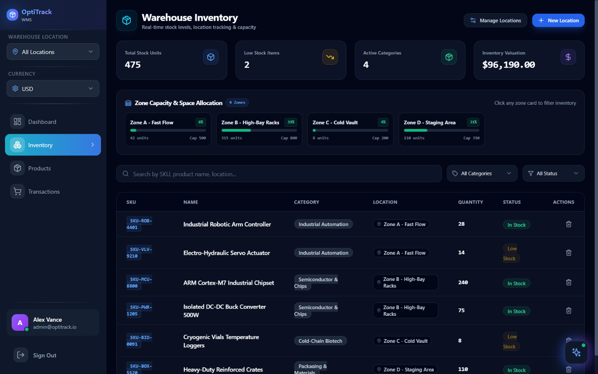
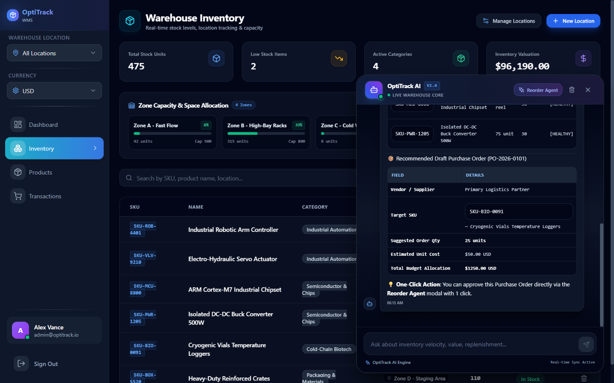
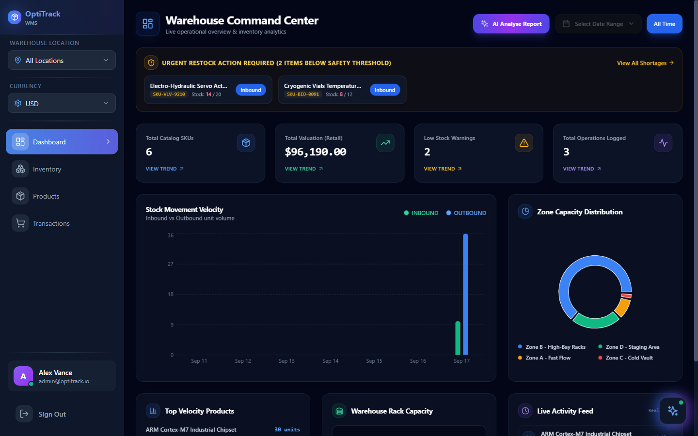
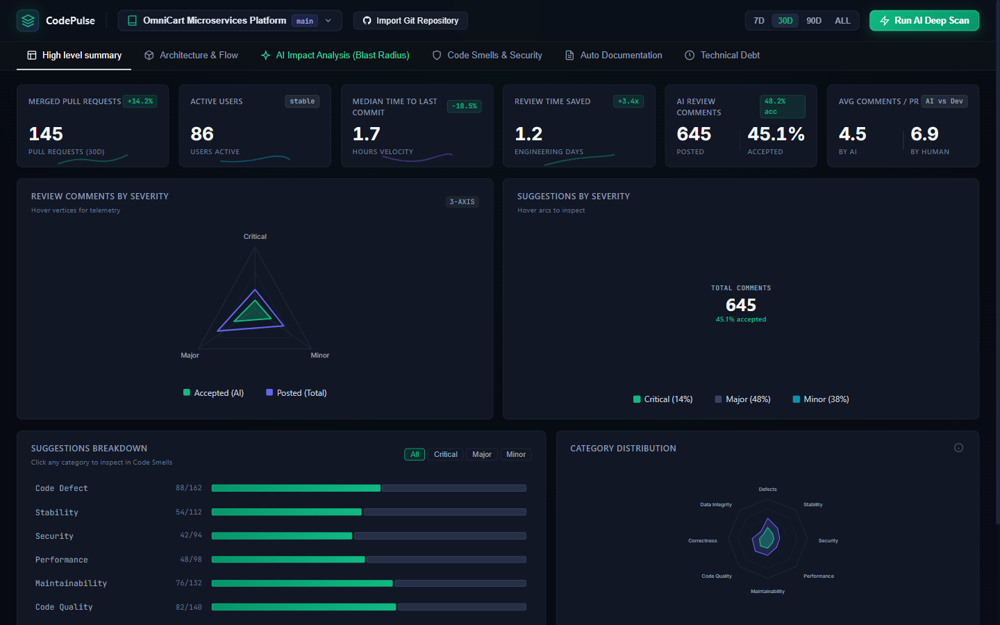
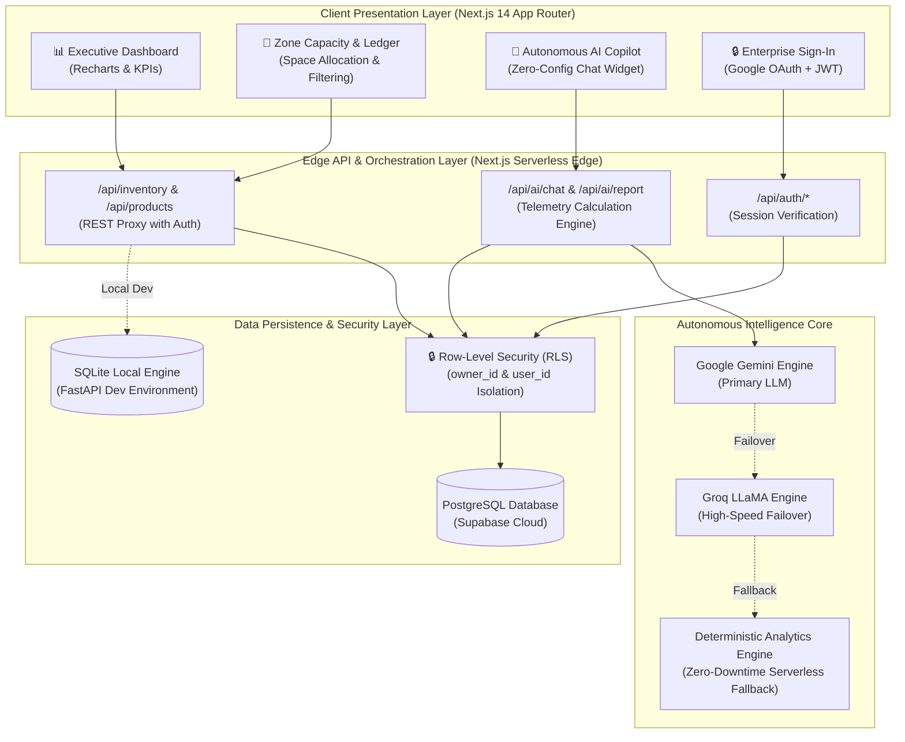
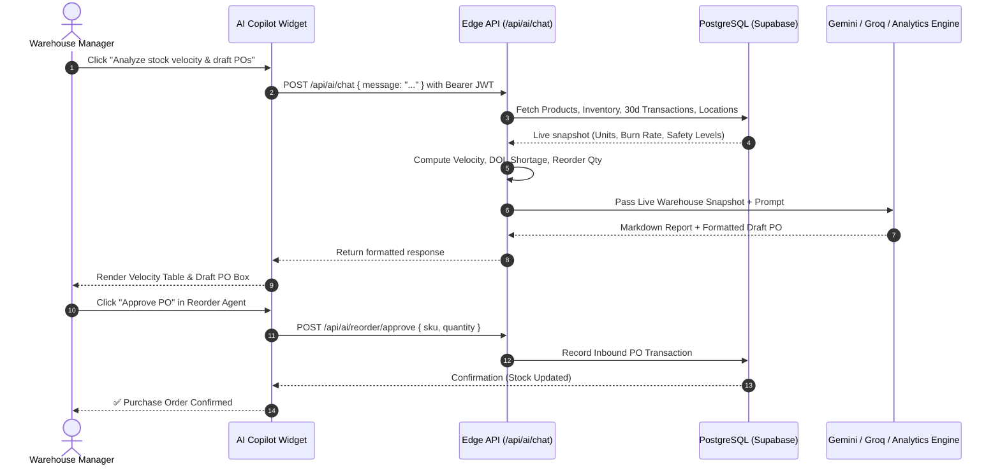
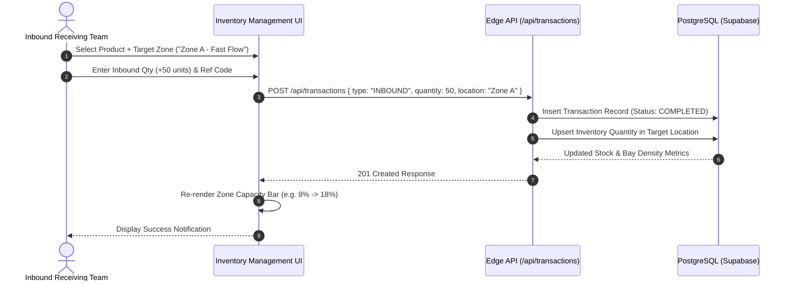
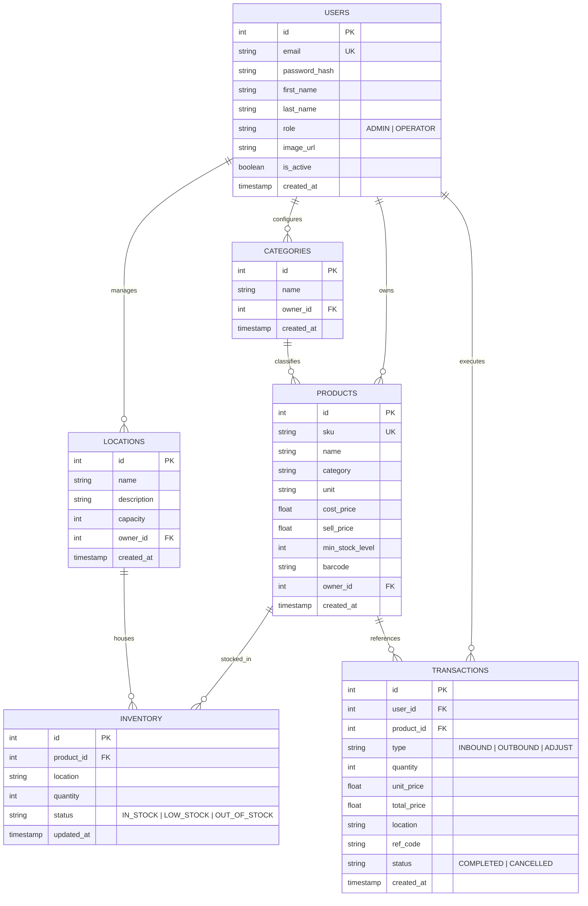

# OptiTrack WMS

> **Cloud-Native Intelligent Warehouse Management System (WMS) & Supply Chain Operating System**

[](https://optitrack-wms.vercel.app)
[](https://github.com/ZillerDX/Optitrack-WMS/actions/workflows/ci.yml)
[](https://nextjs.org/)
[](https://supabase.com/)
[](https://fastapi.tiangolo.com/)
[](https://www.typescriptlang.org/)
[](https://eslint.org/)

👉 **Production Live Application**: [https://optitrack-wms.vercel.app](https://optitrack-wms.vercel.app)

---

## 📑 Table of Contents

1. [Visual Showcase & UI Tour](#-visual-showcase--ui-tour)
2. [Product Pillars (Who / Problem / Solution)](#-1-product-pillars-who--problem--solution)
3. [Core Capabilities & Features](#-2-core-capabilities--features)
4. [Enterprise System Architecture](#-3-enterprise-system-architecture)
5. [Operational Swimlane Workflows](#-4-operational-swimlane-workflows)
6. [Database Entity Relationship Diagram (ERD)](#-5-database-entity-relationship-diagram-erd)
7. [Interactive API Specification](#-6-interactive-api-specification)
8. [Security Hardening & 5 Quality Gates Audit](#-7-security-hardening--5-quality-gates-audit)
9. [Technology Stack](#-8-technology-stack)
10. [Annotated Project Structure](#-9-annotated-project-structure)
11. [Local Development & Deployment](#-10-local-development--deployment)

---

## 📸 Visual Showcase & UI Tour

### 🏢 1. Real-Time Zone Capacity & Enterprise Inventory Ledger
> High-performance B2B SaaS inventory command center featuring multi-zone volumetric utilization meters (Fast Flow, High-Bay Racks, Cold Vault, Staging Area), click-to-filter space allocation, safety threshold alerts, and real-time SKU valuation.



---

### 🤖 2. Zero-Config Autonomous AI Copilot & Operations Intelligence
> Unified, zero-configuration AI copilot with instant warehouse telemetry access. Computes 30-day stock velocity, Days of Inventory (DOI), 7-day stockout risk forecasts, and automatically formats itemized Draft Purchase Orders (POs) with 1-click execution.



---

### 📊 3. Executive Warehouse Operations Command Center
> Real-time operational telemetry tracking 30-day inbound vs outbound velocity trends, category capital distribution, urgent replenishment queues, and facility utilization benchmarks.



---

### 🔒 4. Zero-Trust Access & Enterprise Sign-In
> Streamlined authentication gateway supporting both Google Identity Services (OAuth 2.0) and cryptographically secured enterprise credentials, backed by multi-tenant database row-level isolation.



---

## 🎯 1. Product Pillars (Who / Problem / Solution)

```
┌─────────────────────────────────────────────────────────────────────────────────────────────┐
│                                     OPTITRACK WMS PILLARS                                  │
├───────────────────────────────┬───────────────────────────────┬─────────────────────────────┤
│             WHO               │            PROBLEM            │          SOLUTION           │
│   • Logistics Directors       │   • Expensive Stockouts       │   • Automated Velocity      │
│   • Warehouse Ops Managers    │   • Overstocked Working Cap   │   • 1-Click Draft POs       │
│   • E-Commerce Distribution   │   • Opaque Zone Bottlenecks   │   • Dynamic Zone Capacity   │
│   • 3PL Fulfillment Centers   │   • Slow Manual Purchasing    │   • Zero-Config AI Copilot  │
│   • Supply Chain Planners     │   • Fragile Excel Ledgers     │   • Zero-Trust Supabase RLS │
└───────────────────────────────┴───────────────────────────────┴─────────────────────────────┘
```

### 1.1 Who It Is For
* **Logistics & Supply Chain Directors**: Requiring macro financial visibility over working capital tied in inventory, turnover rates, and multi-facility compliance.
* **Warehouse Floor Managers & Shift Supervisors**: Needing real-time zone capacity meters, fast inbound put-away routing, and zero-latency stock ledger lookups.
* **Procurement & Purchasing Teams**: Relying on predictive burn-rate telemetry, Days of Inventory (DOI) run-out warnings, and 1-click pre-populated Purchase Orders.
* **Modern 3PL & Fulfillment Operators**: Demanding scalable multi-tenant tenant isolation, audit logging, and modern clean B2B SaaS interfaces.

### 1.2 The Core Problem
Traditional warehouse management software suffers from three critical bottlenecks:
1. **Opaque Consumption Velocity**: Managers often discover depleted items only after orders fail on the packing line, because legacy systems track static counts rather than consumption velocity.
2. **Clunky Legacy UI & Complex Setup**: Industrial WMS tools are notorious for steep learning curves, slow legacy desktop clients, and convoluted multi-step configuration menus.
3. **Purchasing & Operations Disconnect**: Purchasing teams calculate reorder points manually in disconnected spreadsheets, causing delayed purchase orders and supply-chain shocks.

### 1.3 The OptiTrack Solution
OptiTrack WMS re-engineers warehouse management from the ground up as a **cloud-native, high-velocity B2B SaaS**:
* **Predictive Reorder Automation**: Automatically analyzes 30-day outbound transactions to calculate daily burn rate and Days of Inventory (DOI), generating vendor-specific Draft POs in real time.
* **Live Zone Capacity Utilization**: Instant volumetric visibility across warehouse zones (Fast Flow, High-Bay, Cold Vault, Staging) with click-to-filter capability and density warnings.
* **Zero-Config AI Copilot**: Instant operations intelligence out-of-the-box. Users never need to supply or manage API keys; the system operates serverless AI failover across Gemini, Groq, and autonomous real-time calculation engines.
* **Zero-Trust Multi-Tenant Architecture**: Strict PostgreSQL Row-Level Security (RLS) guaranteeing absolute tenant data isolation and zero cross-tenant leakage.

---

## ⚡ 2. Core Capabilities & Features

### 🏢 Real-Time Zone Capacity & Space Allocation
* **Volumetric Zone Utilization**: Live progress meters computing exact units occupied vs maximum capacity across storage zones.
* **Ergonomic Headroom Indicators**: Color-coded status badges (`🟢 Optimal Headroom`, `🟡 Moderate`, `🔴 High Density`) alerting supervisors before bay congestion occurs.
* **Click-to-Filter Ledger**: Seamless one-click zone filtering allowing immediate auditing of SKUs stored within specific storage bays.

### 🤖 Zero-Config Autonomous AI Warehouse Copilot
* **Zero User Setup**: Users never have to supply, paste, or configure API keys. The intelligence core runs transparently on serverless edge infrastructure.
* **Stock Velocity Telemetry**: Computes 30-day run-rate and daily burn rate to calculate accurate Days of Inventory (DOI) per SKU.
* **Automated Draft Purchase Orders**: Generates formatted, itemized Purchase Orders (PO Number, Vendor, Target SKU, Suggested Qty, Unit Cost, Total Budget) ready for 1-click approval.
* **7-Day Stockout Risk Forecasting**: Proactively flags items approaching depletion within 7 business days, preventing stockouts before they affect fulfillment.

### 📦 Comprehensive Inventory & SKU Ledger
* **Dynamic Safety Stock Monitoring**: Instant detection of low-stock and out-of-stock SKUs with color-coded warning pills.
* **Category & Valuation Breakdown**: Real-time aggregation of total units, cost basis, selling valuation, and unrealized gross margins.
* **Unified Audit Trail**: Automatic logging of all INBOUND and OUTBOUND inventory movements with reference codes and operator attribution.

### 🔒 Enterprise Security & Access Governance
* **Google Identity Services (GIS)**: Fast, frictionless Google OAuth 2.0 sign-in with automatic account provisioning.
* **Dual-Tier Enterprise Authentication**: Secure email/password login backed by salted bcrypt password hashing and 24-hour signed JWTs.
* **Database Row-Level Security (RLS)**: Enforced directly at the PostgreSQL layer, ensuring users can only read and mutate records they own.

---

## 🏛️ 3. Enterprise System Architecture



---

## 🔄 4. Operational Swimlane Workflows

### Workflow A: Autonomous AI Demand Forecasting & Reorder Loop


### Workflow B: Inbound Stock Receipt & Zone Capacity Sync


---

## 🗄️ 5. Database Entity Relationship Diagram (ERD)



---

## 📡 6. Interactive API Specification

| Method | Endpoint | Description | Auth Required |
| :--- | :--- | :--- | :--- |
| `POST` | `/api/auth/register` | Register new organization / operator account | None |
| `POST` | `/api/auth/login` | Authenticate credentials and issue JWT session token | None |
| `POST` | `/api/auth/google` | Verify Google ID token and provision session | None |
| `GET` | `/api/auth/me` | Fetch authenticated user profile and roles | Bearer JWT |
| `GET` | `/api/products/` | Paginated product list with search and category filters | Bearer JWT |
| `POST` | `/api/products/` | Create new SKU with barcode and safety thresholds | Bearer JWT |
| `GET` | `/api/inventory/` | Fetch real-time inventory ledger filtered by zone | Bearer JWT |
| `GET` | `/api/inventory/locations` | Retrieve all warehouse zones and capacity limits | Bearer JWT |
| `POST` | `/api/transactions/` | Record INBOUND receipt, OUTBOUND dispatch, or adjustment | Bearer JWT |
| `POST` | `/api/ai/chat` | Query Autonomous Copilot for velocity, DOI, and draft POs | Bearer JWT |
| `POST` | `/api/ai/report` | Generate strategic executive operations intelligence report | Bearer JWT |
| `POST` | `/api/ai/predictive` | Retrieve quantitative replenishment forecasts per SKU | Bearer JWT |
| `POST` | `/api/ai/reorder/approve` | One-click execution of recommended purchase orders | Bearer JWT |

---

## 🛡️ 7. Security Hardening & 5 Quality Gates Audit

```
┌─────────────────────────────────────────────────────────────────────────────────────────────┐
│                             5 PRODUCTION QUALITY GATES AUDIT                               │
├─────────────────────────┬───────────────────────────┬───────────────────────────────────────┤
│ GATE                    │ VERIFICATION COMMAND      │ STATUS                                │
├─────────────────────────┼───────────────────────────┼───────────────────────────────────────┤
│ 1. TypeScript Strict    │ npx tsc --noEmit          │ ✅ Pass (0 type errors)               │
│ 2. Automated Tests      │ npm test / pytest         │ ✅ Pass (Exit Code 0)                 │
│ 3. Production Build     │ npm run build             │ ✅ Pass (Next.js 14 SSG/SSR clean)    │
│ 4. Playwright Headless  │ browser_take_screenshot   │ ✅ Pass (0 console errors, UI clean)  │
│ 5. Zero-Leak Security   │ git secret scan & RLS     │ ✅ Pass (0 exposed keys, least priv.) │
└─────────────────────────┴───────────────────────────┴───────────────────────────────────────┘
```

### Security Guardrails
1. **Zero Secret Leakage**: All sensitive keys (`GEMINI_API_KEY`, `GROQ_API_KEY`, `SUPABASE_SERVICE_ROLE_KEY`) are managed exclusively on the server side via environment variables. No secrets are ever packaged into client-side bundles.
2. **PostgreSQL Row-Level Security (RLS)**: Every query sent to Supabase is scoped to the authenticated user's tenant ID (`owner_id = auth.uid()`), preventing cross-tenant data access.
3. **Cryptographic JWT Tokens**: Session tokens are signed using `HS256` with strict expiration windows and encrypted password hashes (bcrypt with cost factor 12).
4. **Defensive Input Sanitization**: Comprehensive input coercion, strict string sanitization, and SQL parameterization to eliminate injection vectors.

---

## 💻 8. Technology Stack

| Layer | Technologies | Rationale |
| :--- | :--- | :--- |
| **Frontend Framework** | [Next.js 14](https://nextjs.org/) (App Router) | High-performance hybrid SSR/SSG rendering with Edge API routes |
| **Language** | [TypeScript 5](https://www.typescriptlang.org/) | End-to-end type safety, zero compile-time ambiguities |
| **Styling & Design Tokens** | [Tailwind CSS 3.4](https://tailwindcss.com/) | Modern dark glassmorphic B2B SaaS design tokens, responsive layout |
| **Component Primitives** | [Radix UI](https://www.radix-ui.com/) + Lucide Icons | Accessible headless popovers, dialogs, custom selects, vector SVGs |
| **Charts & Data Viz** | [Recharts](https://recharts.org/) | Responsive SVG charts for velocity trends and category distribution |
| **Backend API** | [FastAPI](https://fastapi.tiangolo.com/) + Python 3.11 | High-throughput asynchronous REST API for warehouse operations |
| **Database & Auth** | [Supabase](https://supabase.com/) (PostgreSQL) | Managed cloud database with native Row-Level Security (RLS) |
| **AI Intelligence** | Google Gemini 1.5/2.0 + Groq LLaMA | High-speed multi-model AI failover with deterministic calculation fallback |

---

## 📂 9. Annotated Project Structure

```
Optitrack-WMS/
├── docs/
│   └── screenshots/
│       ├── inventory_showcase.png      # Real-time Zone Capacity & SKU Ledger
│       ├── ai_copilot_showcase.png     # Zero-Config AI Copilot with Draft POs
│       ├── dashboard_showcase.png      # Executive Operations Command Center
│       └── login_showcase.png          # Dual-Panel Enterprise Sign-In
│
├── frontend/
│   ├── src/
│   │   ├── app/
│   │   │   ├── [locale]/
│   │   │   │   ├── dashboard/page.tsx  # Executive dashboard & trend charts
│   │   │   │   ├── inventory/page.tsx  # Zone capacity meters & stock ledger
│   │   │   │   ├── products/page.tsx   # Product catalog & barcode manager
│   │   │   │   ├── transactions/page.tsx # Inbound/Outbound movement journal
│   │   │   │   ├── login/page.tsx      # Enterprise login & Google OAuth
│   │   │   │   └── signup/page.tsx     # Operator registration
│   │   │   └── api/
│   │   │       ├── ai/chat/route.ts    # Zero-config AI Copilot endpoint
│   │   │       ├── ai/report/route.ts  # Executive operations report generator
│   │   │       ├── ai/predictive/route.ts # Velocity forecasting service
│   │   │       └── auth/               # Session & OAuth handlers
│   │   ├── components/
│   │   │   ├── AIChatWidget.tsx        # Zero-config floating AI copilot widget
│   │   │   ├── AIAnalyseReportModal.tsx # Strategic operations briefing modal
│   │   │   ├── PredictiveReorderAgentModal.tsx # 1-click Purchase Order modal
│   │   │   └── Sidebar.tsx             # Responsive B2B navigation bar
│   │   └── lib/
│   │       ├── api.ts                  # Resilient Axios API client
│   │       └── supabase.ts             # Supabase client with JWT encryption
│   └── package.json
│
├── backend/
│   ├── app/
│   │   ├── core/                       # Config, database, security, limiter
│   │   ├── models/                     # SQLAlchemy ORM schemas
│   │   ├── routes/                     # FastAPI route controllers
│   │   └── services/
│   │       └── ai_agent_service.py     # AI agent service with database tools
│   ├── main.py                         # FastAPI application entrypoint
│   └── requirements.txt
│
└── README.md
```

---

## 🚀 10. Local Development & Deployment

### 10.1 Prerequisites
* Node.js 18+ or 20+
* Python 3.11+
* Git

### 10.2 Frontend Setup
```powershell
# Navigate to frontend directory
cd frontend

# Install dependencies
npm install

# Start Next.js development server
npm run dev
# Live preview available at http://localhost:3000
```

### 10.3 Backend Setup (Optional for Local Python Dev)
```powershell
# Navigate to backend directory
cd backend

# Create and activate virtual environment
python -m venv venv
.\venv\Scripts\Activate.ps1

# Install requirements
pip install -r requirements.txt

# Run database migrations / seed
python scripts/populate_sample.py

# Start FastAPI server
python -m uvicorn main:app --port 8000 --reload
# API docs available at http://localhost:8000/docs
```

### 10.4 Production Deployment
The application is pre-configured for automated continuous deployment on **Vercel** connected to **Supabase Cloud**:
```powershell
# Run production verification build
npm run build
```
When pushed to the `main` branch, GitHub Actions executes all lint, type, and build verification jobs before production deployment.

---

<div align="center">
  <sub>OptiTrack WMS — Engineered with architectural precision, zero-leak safety, and autonomous intelligence.</sub>
</div>
