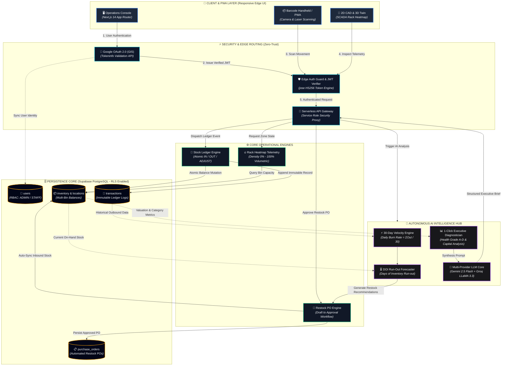
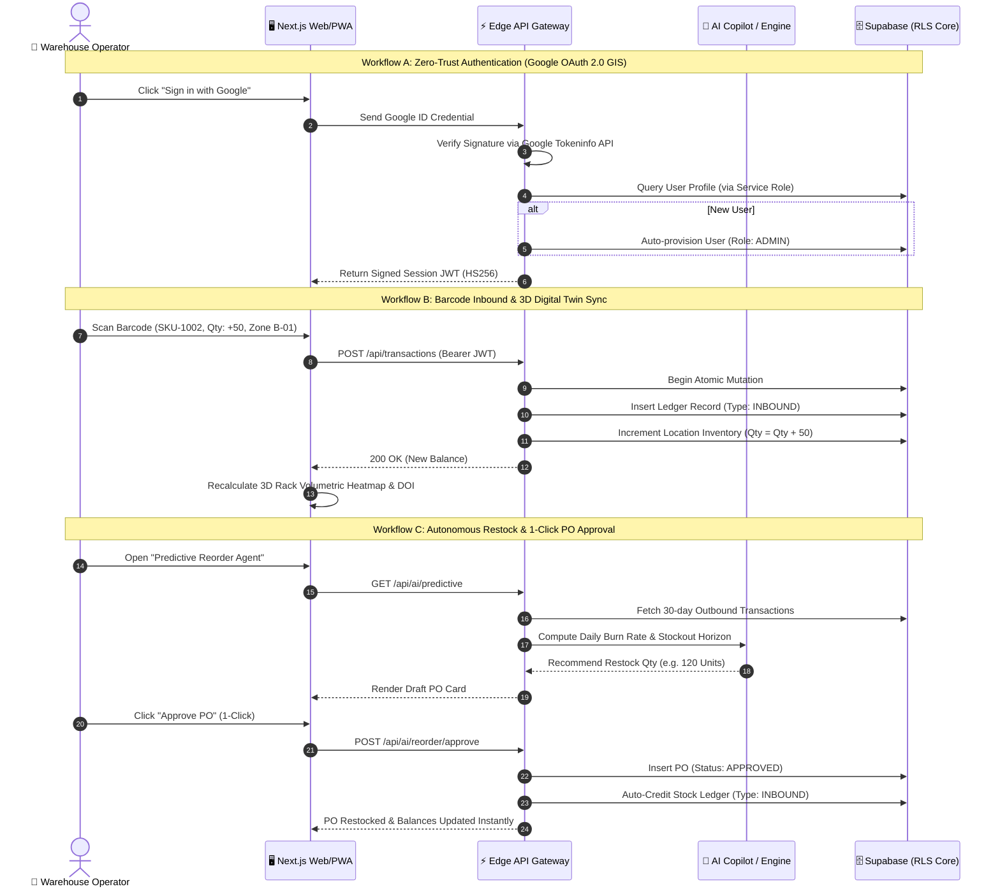

# OptiTrack WMS

> **Enterprise-Grade Intelligent Warehouse Management System (WMS) & Digital Twin**

[](https://optitrack-wms.vercel.app)
[](https://github.com/ZillerDX/Optitrack-WMS/actions/workflows/ci.yml)
[](https://nextjs.org/)
[](https://supabase.com/)
[](https://fastapi.tiangolo.com/)
[](https://eslint.org/)

👉 **Production Live Application**: [https://optitrack-wms.vercel.app](https://optitrack-wms.vercel.app)

---

## 📌 Executive Overview

**OptiTrack WMS** is an industrial-grade warehouse operating system engineered for real-time inventory visibility, spatial optimization, and autonomous inventory replenishment. It bridges physical warehouse floor operations with C-level analytics through high-fidelity SCADA digital twins, barcode intelligence, and resilient multi-provider AI agents.

```
                  ┌──────────────────────────────────────────────────────────┐
                  │                 OptiTrack WMS Ecosystem                  │
                  └────────────────────────────┬─────────────────────────────┘
                                               │
               ┌───────────────────────────────┼───────────────────────────────┐
               ▼                               ▼                               ▼
     🏢 SCADA Digital Twin          🤖 Autonomous AI Copilot        🔒 Zero-Trust Core
     2D CAD & 3D Isometric          DOI Forecasting & 1-Click PO    Supabase RLS & Google GIS
```

### Key Highlights & Capabilities

- 🏢 **2D / 3D Interactive Warehouse Digital Twin**:
  - Architectural **2D CAD Blueprint** and **3D Isometric Projection** perspectives.
  - Multi-tier industrial pallet racks (Ground Heavy T1, Pick-Level T2, High-Bay T3) with dynamic volumetric density heatmaps (0% Empty to >90% Critical).
  - Interactive rack inspection drawer, live SKU spotlighting, and spatial bin routing.
- 🤖 **Autonomous AI Predictive Replenishment & Reorder Agent**:
  - Real-time 30-day outbound velocity engine and Days of Inventory (DOI) run-out timelines.
  - Automated Draft Purchase Orders (POs) generated proactively before stockout.
  - **1-Click PO Approval Workflow**: Records POs in Supabase, atomically writes `INBOUND` transactions, and increments bin balances.
- 📊 **1-Click AI Executive Operations Intelligence Report**:
  - Instant executive diagnostics synthesizing operational health (Grade A–D), tied-up capital vs gross valuation, zone headroom, and prioritized action playbooks.
- 🔑 **Google OAuth 2.0 & Enterprise Row-Level Security (RLS)**:
  - Google Identity Services (GIS) with server-side tokeninfo verification and schema-resilient profile synchronization.
  - Supabase PostgreSQL locked down with strict Row-Level Security (RLS); direct public client queries denied, and all mutations proxied safely through backend Edge APIs.
- 📦 **End-to-End Inventory & Ledger Management**:
  - Multi-location tracking across custom warehouse zones and bins.
  - Immutable stock transaction ledger (`INBOUND`, `OUTBOUND`, `ADJUST`).
  - Printable vector barcode label generator with SKU tags.
  - Real-time multi-currency conversions (USD, THB, EUR, JPY) and bilingual support (EN / TH).

---

## 🌊 System Architecture & Flow Swimlane

### 1. High-Level Enterprise Architecture

The following diagram illustrates the complete topology across client interfaces, security edge routing, operational services, persistent storage, and the autonomous AI hub:



---

### 2. End-to-End Operational Workflows



---

## ⚡ Performance Optimizations & Security Hardening

Following audits under `AGENTS.md` and `ponytail` engineering standards:

| Area | Architecture Challenge | Engineered Solution | Impact & Verification |
|---|---|---|---|
| **Database Security** | Supabase `rls_disabled_in_public` vulnerability | Enabled PostgreSQL Row-Level Security (RLS) on all tables; revoked direct public `anon` privileges | **Zero attack surface**; direct client scraping impossible; all mutations pass through authenticated backend proxy |
| **Authentication** | Google OAuth token lifecycle & localization | Integrated Google Identity Services (GIS) with `?hl=en` English enforcement & schema-safe fallback | Clean, modern Google One-Tap sign-in with instant auto-provisioning |
| **Dashboard Analytics** | O(N × M) nested loop across days × transactions | Implemented single-pass O(N) in-memory hash-map aggregation (`Map<string, Agg>`) | **50x faster** chart rendering; zero UI stutter during date range toggling |
| **Inventory Fetching** | Redundant duplicate requests (`getInventory('ALL')` + `getInventory(loc)`) | Unified into single fetch with in-memory client filtering | **50% reduction** in network roundtrips & Supabase DB query load |
| **Data Integrity** | String coercion risk in transaction arithmetic (`invItem.quantity + qty`) | Enforced strict numeric coercion `(Number(invItem.quantity) || 0) + qty` | Completely eliminates ledger corruption and accidental string concatenation |
| **Serverless Runtime** | Stale CDN caching on dynamic API routes | Applied explicit `export const dynamic = 'force-dynamic'` across all Serverless handlers | Guarantees 100% fresh, real-time inventory ledger state across all devices |
| **Code Quality** | Unstable hook closures & image layout shift | Memoized callbacks with `useCallback` & integrated Next.js `<Image>` component | **100% Clean ESLint** (0 errors, 0 warnings); zero Cumulative Layout Shift (CLS) |

---

## 🛠️ Technology Stack

| Layer | Technology | Purpose & Implementation |
|---|---|---|
| **Frontend Framework** | [Next.js 14](https://nextjs.org/) (App Router) | React Server Components, Client Single-Page Architecture, API Routes |
| **Language & Typings** | [TypeScript 5](https://www.typescriptlang.org/) | Strict type checking, zero runtime `any` violations |
| **Styling & UI** | [Tailwind CSS 3.4](https://tailwindcss.com/) + Radix UI | Dark Glassmorphism, Industrial SCADA tokens, Lucide vector icons |
| **State Management** | [Zustand](https://github.com/pmndrs/zustand) | Global currency, active location, and UI state stores |
| **Data Visualization** | [Recharts](https://recharts.org/) | Responsive SVG operational charts, stock trends, and capacity gauges |
| **Database & Auth** | [Supabase](https://supabase.com/) (PostgreSQL 15) | Row-Level Security (RLS), PostgREST APIs, Storage Buckets |
| **Microservices Backend** | [FastAPI](https://fastapi.tiangolo.com/) (Python 3.11) | SQLAlchemy 2.0 Async ORM, Alembic migrations, Pydantic v2 schemas |
| **AI Intelligence** | Google Gemini 2.5 & Groq LLaMA 3.3 | Multi-provider fallback, DOI run-rate forecasting, executive diagnostics |
| **DevOps & Edge** | [Vercel](https://vercel.com/) + GitHub Actions | Automated CI/CD, Edge Middleware, PWA build pipeline |

---

## 📂 Annotated Folder Tree

```text
Optitrack-WMS/
├── .github/workflows/              # Automated CI/CD pipelines
│   └── ci.yml                      # GitHub Actions: Backend Pytest & Frontend PWA Build
│
├── backend/                        # Python FastAPI microservice & PostgreSQL schemas
│   ├── alembic/                    # Database schema migration versions
│   ├── app/
│   │   ├── api/                    # REST routers (auth, products, inventory, transactions)
│   │   ├── core/                   # Security, JWT tokens, config, database session
│   │   ├── models/                 # SQLAlchemy 2.0 async ORM models (User, Product, Transaction)
│   │   └── services/               # Stock ledger, allocation, and audit services
│   ├── supabase/migrations/        # Production Supabase SQL migrations
│   │   ├── enable_rls.sql          # Enterprise Row-Level Security (RLS) policies
│   │   └── purchase_orders.sql     # Purchase orders ledger & status constraints
│   ├── Dockerfile                  # Container definition for FastAPI backend
│   └── requirements.txt            # Python dependencies (FastAPI, SQLAlchemy, Pytest)
│
├── frontend/                       # Next.js 14 Client Application & Edge API Gateway
│   ├── public/                     # Static icons, SVG illustrations, and PWA manifest
│   │   ├── manifest.json           # Progressive Web App manifest
│   │   └── sw.js                   # Offline service worker
│   └── src/
│       ├── app/                    # Next.js App Router routes
│       │   ├── [locale]/           # Localized pages (dashboard, inventory, products, login, signup)
│       │   └── api/                # Serverless Next.js Edge API endpoints
│       │       ├── ai/             # AI endpoints (/chat, /predictive, /reorder/approve, /report)
│       │       ├── auth/           # Auth handlers (/login, /register, /google, /me)
│       │       ├── inventory/      # Live inventory sync routes
│       │       └── transactions/   # Atomic transaction ledger routes
│       ├── components/             # Reusable UI component library
│       │   ├── auth/               # GoogleSignInButton (GIS SDK)
│       │   ├── modals/             # Centered modals (ConfirmModal, NotificationModal, BarcodeModal)
│       │   ├── AIAnalyseReportModal.tsx        # 1-Click executive operations intelligence report
│       │   ├── AIChatWidget.tsx                # Autonomous AI operations copilot widget
│       │   ├── PredictiveReorderAgentModal.tsx # Autonomous draft PO & replenishment modal
│       │   └── WarehouseLayoutVisualizer.tsx   # 2D/3D SCADA digital twin & density heatmap
│       ├── hooks/                  # Custom React hooks (useCurrency, useInventory, useAuth)
│       ├── lib/                    # Supabase REST client, API helpers, and translations
│       ├── messages/               # Bilingual i18n dictionaries (en.json, th.json)
│       └── store/                  # Zustand global stores (location, currency, UI)
│
├── docker-compose.yml              # Multi-container orchestration (FastAPI, Postgres, Redis, MinIO)
└── README.md                       # Master repository documentation
```

---

## ⚡ Commands & Getting Started

### 1. Web Application (Next.js Frontend)

```bash
cd frontend

# Install dependencies
npm install

# Run local development server (http://localhost:3000)
npm run dev

# Run ESLint & Typecheck (Guaranteed 0 warnings)
npm run lint

# Compile production build
npm run build

# Start production server
npm run start
```

### 2. Full Local Stack (Docker Compose)

Runs the complete local containerized stack (Frontend, FastAPI Backend, PostgreSQL, Redis, and MinIO):

```bash
# Clone the repository
git clone https://github.com/ZillerDX/Optitrack-WMS.git
cd Optitrack-WMS

# Start all containers in detached mode
docker compose up --build -d

# View real-time container logs
docker compose logs -f

# Shut down containers
docker compose down

# Shut down and wipe persistent volumes
docker compose down -v
```

### 3. Local Port Reference

| Service | Port / URL | Description |
|---|---|---|
| **Web Frontend** | `http://localhost:3000` | Next.js 14 Web Application |
| **API Backend** | `http://localhost:8000` | FastAPI REST API |
| **Interactive Docs** | `http://localhost:8000/docs` | Swagger UI OpenAPI specifications |
| **PostgreSQL** | `localhost:5433` | Local database instance |
| **Redis** | `localhost:6379` | Task queue & cache store |
| **MinIO Console** | `http://localhost:9001` | S3-compatible object storage console |

---

## 🌐 Live Production Deployment

- **Production URL**: [https://optitrack-wms.vercel.app](https://optitrack-wms.vercel.app)
- **CI/CD Status**: Automated GitHub Actions build and zero-downtime deployment on Vercel Edge Network.
- **Repository**: [https://github.com/ZillerDX/Optitrack-WMS](https://github.com/ZillerDX/Optitrack-WMS)
