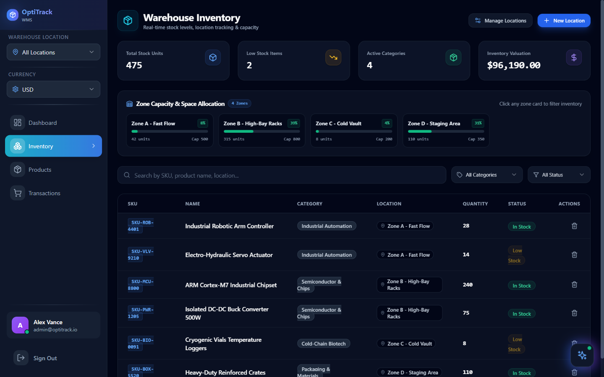
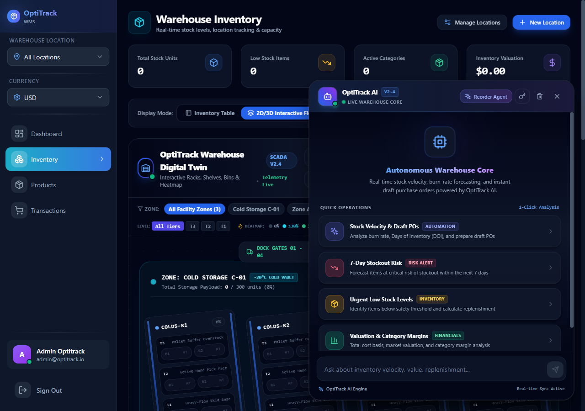
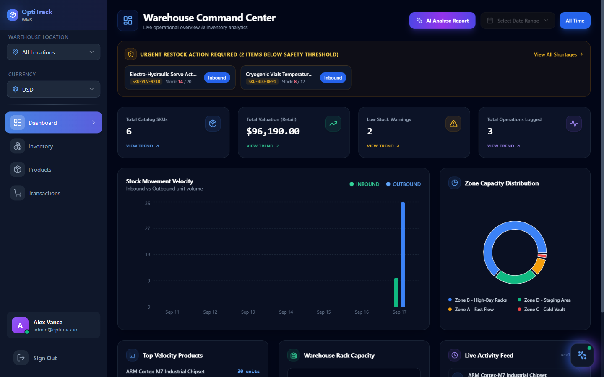
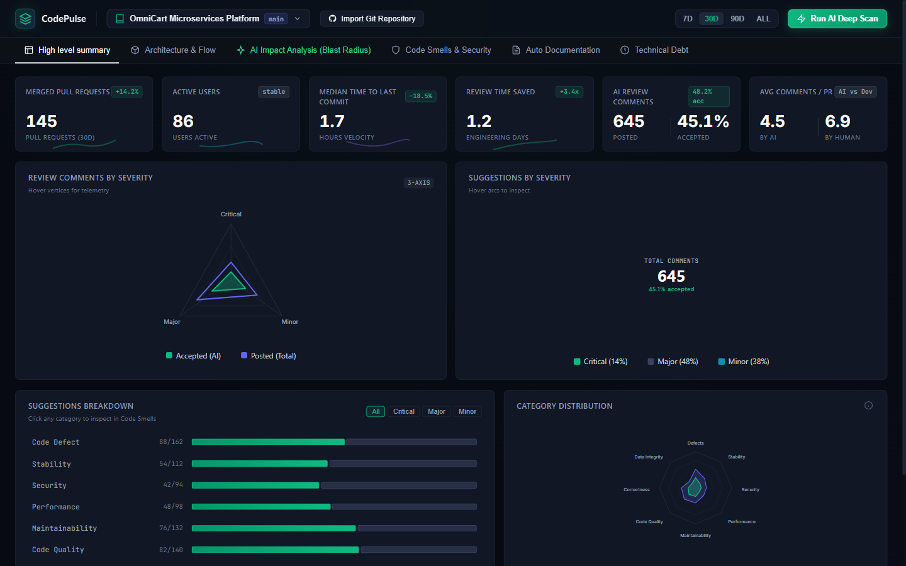
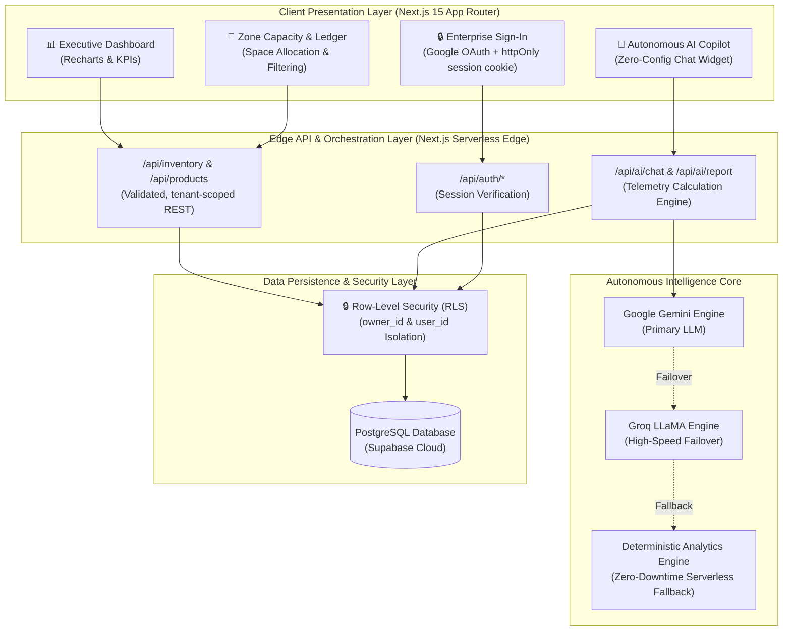
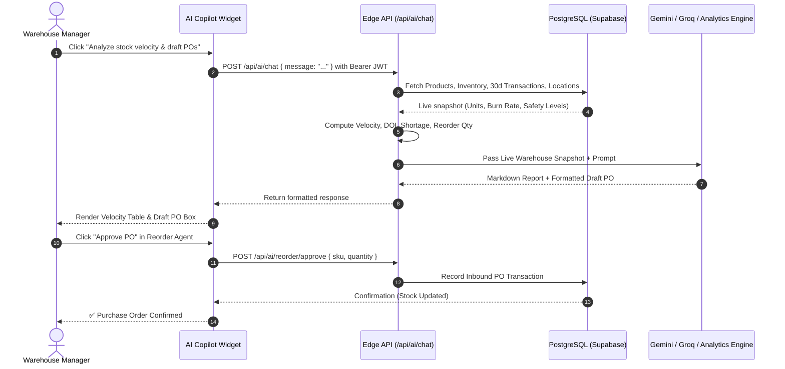
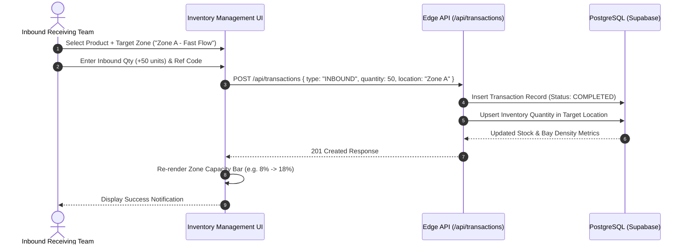
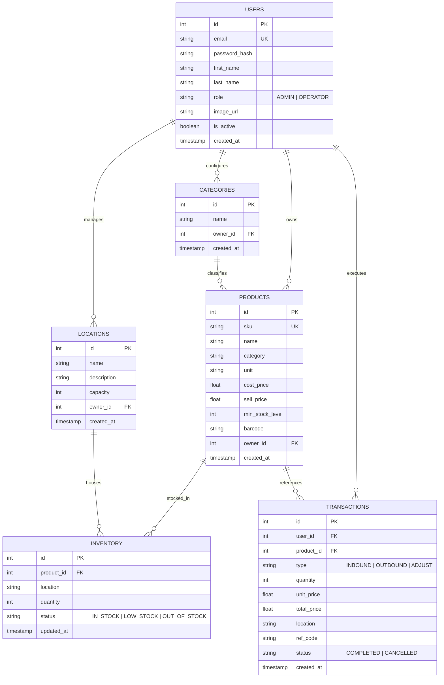

# OptiTrack WMS

> **Cloud-Native Intelligent Warehouse Management System (WMS) & Supply Chain Operating System**

[](https://optitrack-wms.vercel.app)
[](https://github.com/ZillerDX/Optitrack-WMS/actions/workflows/ci.yml)
[](https://nextjs.org/)
[](https://supabase.com/)
[](https://www.typescriptlang.org/)
[](https://eslint.org/)

👉 **Production Live Application**: [https://optitrack-wms.vercel.app](https://optitrack-wms.vercel.app)

---

## 📑 Table of Contents

1. [Visual Showcase & UI Tour](#-visual-showcase--ui-tour)
2. [Product Pillars (Who / Problem / Solution)](#-1-product-pillars-who--problem--solution)
3. [Core Capabilities & Features](#-2-core-capabilities--features)
4. [Enterprise System Architecture](#-3-enterprise-system-architecture)
5. [Operational Swimlane Workflows](#-4-operational-swimlane-workflows)
6. [Database Entity Relationship Diagram (ERD)](#-5-database-entity-relationship-diagram-erd)
7. [Interactive API Specification](#-6-interactive-api-specification)
8. [Security Hardening & 5 Quality Gates Audit](#-7-security-hardening--5-quality-gates-audit)
9. [Technology Stack](#-8-technology-stack)
10. [Annotated Project Structure](#-9-annotated-project-structure)
11. [Local Development & Deployment](#-10-local-development--deployment)

---

## 📸 Visual Showcase & UI Tour

### 🏢 1. Real-Time Zone Capacity & Enterprise Inventory Ledger
> High-performance B2B SaaS inventory command center featuring multi-zone volumetric utilization meters (Fast Flow, High-Bay Racks, Cold Vault, Staging Area), click-to-filter space allocation, safety threshold alerts, and real-time SKU valuation.



---

### 🤖 2. Zero-Config Autonomous AI Copilot & Operations Intelligence
> Unified, zero-configuration AI copilot with instant warehouse telemetry access. Computes 30-day stock velocity, Days of Inventory (DOI), 7-day stockout risk forecasts, and automatically formats itemized Draft Purchase Orders (POs) with 1-click execution.



---

### 📊 3. Executive Warehouse Operations Command Center
> Real-time operational telemetry tracking 30-day inbound vs outbound velocity trends, category capital distribution, urgent replenishment queues, and facility utilization benchmarks.



---

### 🔒 4. Zero-Trust Access & Enterprise Sign-In
> Streamlined authentication gateway supporting both Google Identity Services (OAuth 2.0) and cryptographically secured enterprise credentials, backed by multi-tenant database row-level isolation.



---

## 🎯 1. Product Pillars (Who / Problem / Solution)

```
┌─────────────────────────────────────────────────────────────────────────────────────────────┐
│                                     OPTITRACK WMS PILLARS                                  │
├───────────────────────────────┬───────────────────────────────┬─────────────────────────────┤
│             WHO               │            PROBLEM            │          SOLUTION           │
│   • Logistics Directors       │   • Expensive Stockouts       │   • Automated Velocity      │
│   • Warehouse Ops Managers    │   • Overstocked Working Cap   │   • 1-Click Draft POs       │
│   • E-Commerce Distribution   │   • Opaque Zone Bottlenecks   │   • Dynamic Zone Capacity   │
│   • 3PL Fulfillment Centers   │   • Slow Manual Purchasing    │   • Zero-Config AI Copilot  │
│   • Supply Chain Planners     │   • Fragile Excel Ledgers     │   • Zero-Trust Supabase RLS │
└───────────────────────────────┴───────────────────────────────┴─────────────────────────────┘
```

### 1.1 Who It Is For
* **Logistics & Supply Chain Directors**: Requiring macro financial visibility over working capital tied in inventory, turnover rates, and multi-facility compliance.
* **Warehouse Floor Managers & Shift Supervisors**: Needing real-time zone capacity meters, fast inbound put-away routing, and zero-latency stock ledger lookups.
* **Procurement & Purchasing Teams**: Relying on predictive burn-rate telemetry, Days of Inventory (DOI) run-out warnings, and 1-click pre-populated Purchase Orders.
* **Modern 3PL & Fulfillment Operators**: Demanding scalable multi-tenant tenant isolation, audit logging, and modern clean B2B SaaS interfaces.

### 1.2 The Core Problem
Traditional warehouse management software suffers from three critical bottlenecks:
1. **Opaque Consumption Velocity**: Managers often discover depleted items only after orders fail on the packing line, because legacy systems track static counts rather than consumption velocity.
2. **Clunky Legacy UI & Complex Setup**: Industrial WMS tools are notorious for steep learning curves, slow legacy desktop clients, and convoluted multi-step configuration menus.
3. **Purchasing & Operations Disconnect**: Purchasing teams calculate reorder points manually in disconnected spreadsheets, causing delayed purchase orders and supply-chain shocks.

### 1.3 The OptiTrack Solution
OptiTrack WMS re-engineers warehouse management from the ground up as a **cloud-native, high-velocity B2B SaaS**:
* **Predictive Reorder Automation**: Automatically analyzes 30-day outbound transactions to calculate daily burn rate and Days of Inventory (DOI), generating vendor-specific Draft POs in real time.
* **Live Zone Capacity Utilization**: Instant volumetric visibility across warehouse zones (Fast Flow, High-Bay, Cold Vault, Staging) with click-to-filter capability and density warnings.
* **Zero-Config AI Copilot**: Instant operations intelligence out-of-the-box. Users never need to supply or manage API keys; the system operates serverless AI failover across Gemini, Groq, and autonomous real-time calculation engines.
* **Zero-Trust Multi-Tenant Architecture**: Strict PostgreSQL Row-Level Security (RLS) guaranteeing absolute tenant data isolation and zero cross-tenant leakage.

---

## ⚡ 2. Core Capabilities & Features

### 🏢 Real-Time Zone Capacity & Space Allocation
* **Volumetric Zone Utilization**: Live progress meters computing exact units occupied vs maximum capacity across storage zones.
* **Ergonomic Headroom Indicators**: Color-coded status badges (`🟢 Optimal Headroom`, `🟡 Moderate`, `🔴 High Density`) alerting supervisors before bay congestion occurs.
* **Click-to-Filter Ledger**: Seamless one-click zone filtering allowing immediate auditing of SKUs stored within specific storage bays.

### 🤖 Zero-Config Autonomous AI Warehouse Copilot
* **Zero User Setup**: Users never have to supply, paste, or configure API keys. The intelligence core runs transparently on serverless edge infrastructure.
* **Stock Velocity Telemetry**: Computes 30-day run-rate and daily burn rate to calculate accurate Days of Inventory (DOI) per SKU.
* **Automated Draft Purchase Orders**: Generates formatted, itemized Purchase Orders (PO Number, Vendor, Target SKU, Suggested Qty, Unit Cost, Total Budget) ready for 1-click approval.
* **7-Day Stockout Risk Forecasting**: Proactively flags items approaching depletion within 7 business days, preventing stockouts before they affect fulfillment.

### 📦 Comprehensive Inventory & SKU Ledger
* **Dynamic Safety Stock Monitoring**: Instant detection of low-stock and out-of-stock SKUs with color-coded warning pills.
* **Category & Valuation Breakdown**: Real-time aggregation of total units, cost basis, selling valuation, and unrealized gross margins.
* **Unified Audit Trail**: Automatic logging of all INBOUND and OUTBOUND inventory movements with reference codes and operator attribution.

### 🔒 Enterprise Security & Access Governance
* **Google Identity Services (GIS)**: Fast, frictionless Google OAuth 2.0 sign-in with automatic account provisioning.
* **Dual-Tier Enterprise Authentication**: Secure email/password login backed by salted bcrypt password hashing and 24-hour signed JWTs.
* **Database Row-Level Security (RLS)**: Enforced directly at the PostgreSQL layer, ensuring users can only read and mutate records they own.

---

## 🏛️ 3. Enterprise System Architecture


```mermaid
flowchart TD
    subgraph ClientLayer ["Client Presentation Layer (Next.js 15 App Router)"]
        UI_Dash["📊 Executive Dashboard\n(Recharts & KPIs)"]
        UI_Inv["🏢 Zone Capacity & Ledger\n(Space Allocation & Filtering)"]
        UI_AI["🤖 Autonomous AI Copilot\n(Zero-Config Chat Widget)"]
        UI_Auth["🔒 Enterprise Sign-In\n(Google OAuth + httpOnly session cookie)"]
    end

    subgraph EdgeGateway ["Edge API & Orchestration Layer (Next.js Serverless Edge)"]
        Route_Auth["/api/auth/*\n(Session Verification)"]
        Route_Data["/api/inventory & /api/products\n(Validated, tenant-scoped REST)"]
        Route_AI["/api/ai/chat & /api/ai/report\n(Telemetry Calculation Engine)"]
    end

    subgraph AICore ["Autonomous Intelligence Core"]
        AI_Gemini["Google Gemini Engine\n(Primary LLM)"]
        AI_Groq["Groq LLaMA Engine\n(High-Speed Failover)"]
        AI_Engine["Deterministic Analytics Engine\n(Zero-Downtime Serverless Fallback)"]
    end

    subgraph DataLayer ["Data Persistence & Security Layer"]
        DB_PG[("PostgreSQL Database\n(Supabase Cloud)")]
        DB_RLS["🔒 Row-Level Security (RLS)\n(owner_id & user_id Isolation)"]
    end

    UI_Dash --> Route_Data
    UI_Inv --> Route_Data
    UI_Auth --> Route_Auth
    UI_AI --> Route_AI

    Route_AI --> AI_Gemini
    AI_Gemini -.->|Failover| AI_Groq
    AI_Groq -.->|Fallback| AI_Engine

    Route_Data --> DB_RLS
    Route_AI --> DB_RLS
    Route_Auth --> DB_RLS
    DB_RLS --> DB_PG
```

---

## 🔄 4. Operational Swimlane Workflows

### Workflow A: Autonomous AI Demand Forecasting & Reorder Loop

```mermaid
sequenceDiagram
    autonumber
    actor Manager as Warehouse Manager
    participant Widget as AI Copilot Widget
    participant API as Edge API (/api/ai/chat)
    participant DB as PostgreSQL (Supabase)
    participant LLM as Gemini / Groq / Analytics Engine

    Manager->>Widget: Click "Analyze stock velocity & draft POs"
    Widget->>API: POST /api/ai/chat { message: "..." } with Bearer JWT
    API->>DB: Fetch Products, Inventory, 30d Transactions, Locations
    DB-->>API: Live snapshot (Units, Burn Rate, Safety Levels)
    API->>API: Compute Velocity, DOI, Shortage, Reorder Qty
    API->>LLM: Pass Live Warehouse Snapshot + Prompt
    LLM-->>API: Markdown Report + Formatted Draft PO
    API-->>Widget: Return formatted response
    Widget-->>Manager: Render Velocity Table & Draft PO Box
    Manager->>Widget: Click "Approve PO" in Reorder Agent
    Widget->>API: POST /api/ai/reorder/approve { sku, quantity }
    API->>DB: Record Inbound PO Transaction
    DB-->>Widget: Confirmation (Stock Updated)
    Widget-->>Manager: ✅ Purchase Order Confirmed
```

### Workflow B: Inbound Stock Receipt & Zone Capacity Sync

```mermaid
sequenceDiagram
    autonumber
    actor Operator as Inbound Receiving Team
    participant UI as Inventory Management UI
    participant API as Edge API (/api/transactions)
    participant DB as PostgreSQL (Supabase)

    Operator->>UI: Select Product + Target Zone ("Zone A - Fast Flow")
    Operator->>UI: Enter Inbound Qty (+50 units) & Ref Code
    UI->>API: POST /api/transactions { type: "INBOUND", quantity: 50, location: "Zone A" }
    API->>DB: Insert Transaction Record (Status: COMPLETED)
    API->>DB: Upsert Inventory Quantity in Target Location
    DB-->>API: Updated Stock & Bay Density Metrics
    API-->>UI: 201 Created Response
    UI->>UI: Re-render Zone Capacity Bar (e.g. 8% -> 18%)
    UI-->>Operator: Display Success Notification
```

---

## 🗄️ 5. Database Entity Relationship Diagram (ERD)


```mermaid
erDiagram
    USERS ||--o{ PRODUCTS : owns
    USERS ||--o{ LOCATIONS : manages
    USERS ||--o{ CATEGORIES : configures
    USERS ||--o{ TRANSACTIONS : executes
    CATEGORIES ||--o{ PRODUCTS : classifies
    PRODUCTS ||--o{ INVENTORY : stocked_in
    LOCATIONS ||--o{ INVENTORY : houses
    PRODUCTS ||--o{ TRANSACTIONS : references

    USERS {
        int id PK
        string email UK
        string password_hash
        string first_name
        string last_name
        string role "ADMIN | OPERATOR"
        string image_url
        boolean is_active
        timestamp created_at
    }

    CATEGORIES {
        int id PK
        string name
        int owner_id FK
        timestamp created_at
    }

    LOCATIONS {
        int id PK
        string name
        string description
        int capacity
        int owner_id FK
        timestamp created_at
    }

    PRODUCTS {
        int id PK
        string sku UK
        string name
        string category
        string unit
        float cost_price
        float sell_price
        int min_stock_level
        string barcode
        int owner_id FK
        timestamp created_at
    }

    INVENTORY {
        int id PK
        int product_id FK
        string location
        int quantity
        string status "IN_STOCK | LOW_STOCK | OUT_OF_STOCK"
        timestamp updated_at
    }

    TRANSACTIONS {
        int id PK
        int user_id FK
        int product_id FK
        string type "INBOUND | OUTBOUND | ADJUST"
        int quantity
        float unit_price
        float total_price
        string location
        string ref_code
        string status "COMPLETED | CANCELLED"
        timestamp created_at
    }
```

---

## 📡 6. API Specification

The API is the set of Route Handlers in `frontend/src/app/api`. It is same-origin with the UI and
authenticated by the `__Host-session` cookie (an `Authorization: Bearer` header is also accepted for
non-browser clients). Unauthenticated calls answer `401`; failures answer generic `4xx/5xx` bodies.

| Method | Endpoint | Description | Auth |
| :--- | :--- | :--- | :--- |
| `POST` | `/api/auth/register` | Create an account (optionally limited by `SIGNUP_ALLOWED_DOMAINS`) | None |
| `POST` | `/api/auth/login` | Verify credentials, set the session cookie | None |
| `POST` | `/api/auth/google` | Verify a Google ID token (audience and issuer checked), set the cookie | None |
| `POST` | `/api/auth/logout` | Clear the cookie and revoke all sessions of the user | Session |
| `POST` | `/api/auth/forgot-password` | Email a single-use reset link (same answer for any address) | None |
| `POST` | `/api/auth/reset-password` | Set a new password with a reset token | Reset token |
| `GET` / `PUT` | `/api/auth/me` | Read / update own name and avatar | Session |
| `POST` | `/api/auth/upload-image` | Upload an avatar (image bytes verified) | Session |
| `GET` / `POST` | `/api/products` | List / create products (validated, unique SKU per owner) | Session |
| `PUT` / `DELETE` | `/api/products/{id}` | Update / delete an own product | Session |
| `GET` / `POST` | `/api/inventory` | Stock ledger / create a stock row at an own location | Session |
| `PUT` / `DELETE` | `/api/inventory/{id}` | Edit quantity, status or location of an own row | Session |
| `GET` | `/api/inventory/locations` | Location names of the caller | Session |
| `GET` / `POST` | `/api/locations`, `/api/categories` | List / create (unique name per owner) | Session |
| `PUT` / `DELETE` | `/api/locations/{id}` | Update / delete a location | Session |
| `DELETE` | `/api/categories/{id}` | Delete a category | Session |
| `GET` / `POST` | `/api/transactions` | Movement journal / record INBOUND, OUTBOUND or ADJUST | Session |
| `GET` | `/api/dashboard/metrics` | Capacity usage | Session |
| `POST` | `/api/ai/chat` | AI assistant (rate limited, input validated) | Session |
| `POST` | `/api/ai/report` | Operations report | Session |
| `GET` | `/api/ai/predictive` | Replenishment forecast per SKU | Session |
| `POST` | `/api/ai/reorder/approve` | Approve a reorder: receives stock and stores the PO | Session |

---

## 🛡️ 7. Security Model

What protects the data, and what to verify. See `ARCHITECTURE_SUMMARY.md` for detail.

1. **Tenant isolation lives in the API.** The server talks to Supabase with the service-role key, which
   bypasses Row Level Security, so every handler filters by the caller's `owner_id` / `user_id` and takes
   nothing tenant-related from the request. RLS (`0002_enable_rls.sql`) is deny-by-default for the public
   `anon` key; **check that on your project** by trying to read a table with the anon key.
2. **Sessions.** HS256 JWT in an httpOnly, Secure, SameSite=Lax cookie; each request re-checks that the user
   exists and is active and that the token version is current, so logout, password reset and deactivation
   revoke access. Cookie-authenticated writes must be same-origin (CSRF).
3. **Secrets.** `SECRET_KEY`, `SUPABASE_SERVICE_ROLE_KEY` and the URL have no fallback values: the API
   returns 500 rather than run with a default key. Provider keys (Gemini/Groq) come from the server
   environment only, never from request headers.
4. **Abuse controls.** Shared (Postgres) rate limits on login (per address and per account), sign-up, Google,
   password reset, uploads and AI endpoints; validated input everywhere; generic error bodies.
5. **Browser hardening.** CSP, HSTS, `X-Frame-Options`, `nosniff`, `Referrer-Policy`, `Permissions-Policy`.
   The CSP has to allow inline scripts (statically generated pages), so it is defence in depth, not an XSS
   guarantee.

Automated checks in CI: `npm run lint`, `tsc --noEmit`, `npm test`, `npm audit --omit=dev --audit-level=high`,
`next build`, and the SQL migrations applied twice to a real PostgreSQL.

---

## 💻 8. Technology Stack

| Layer | Technologies | Rationale |
| :--- | :--- | :--- |
| **Frontend Framework** | [Next.js 15](https://nextjs.org/) (App Router, React 19) | High-performance hybrid SSR/SSG rendering with Edge API routes |
| **Language** | [TypeScript 5](https://www.typescriptlang.org/) | End-to-end type safety, zero compile-time ambiguities |
| **Styling & Design Tokens** | [Tailwind CSS 3.4](https://tailwindcss.com/) | Modern dark glassmorphic B2B SaaS design tokens, responsive layout |
| **Component Primitives** | [Radix UI](https://www.radix-ui.com/) + Lucide Icons | Accessible headless popovers, dialogs, custom selects, vector SVGs |
| **Charts & Data Viz** | [Recharts](https://recharts.org/) | Responsive SVG charts for velocity trends and category distribution |
| **Backend API** | Next.js Route Handlers (same app) | One deployable unit for UI and API; validated, tenant-scoped handlers |
| **Database & Auth** | [Supabase](https://supabase.com/) (PostgreSQL) | Managed cloud database with native Row-Level Security (RLS) |
| **AI Intelligence** | Google Gemini 1.5/2.0 + Groq LLaMA | High-speed multi-model AI failover with deterministic calculation fallback |

---

## 📂 9. Annotated Project Structure

```
Optitrack-WMS/
├── docs/
│   └── screenshots/
│       ├── inventory_showcase.png      # Real-time Zone Capacity & SKU Ledger
│       ├── ai_copilot_showcase.png     # Zero-Config AI Copilot with Draft POs
│       ├── dashboard_showcase.png      # Executive Operations Command Center
│       └── login_showcase.png          # Dual-Panel Enterprise Sign-In
│
├── frontend/
│   ├── src/
│   │   ├── app/
│   │   │   ├── [locale]/
│   │   │   │   ├── dashboard/page.tsx  # Executive dashboard & trend charts
│   │   │   │   ├── inventory/page.tsx  # Zone capacity meters & stock ledger
│   │   │   │   ├── products/page.tsx   # Product catalog & barcode manager
│   │   │   │   ├── transactions/page.tsx # Inbound/Outbound movement journal
│   │   │   │   ├── login/page.tsx      # Enterprise login & Google OAuth
│   │   │   │   └── signup/page.tsx     # Operator registration
│   │   │   └── api/
│   │   │       ├── ai/chat/route.ts    # Zero-config AI Copilot endpoint
│   │   │       ├── ai/report/route.ts  # Executive operations report generator
│   │   │       ├── ai/predictive/route.ts # Velocity forecasting service
│   │   │       └── auth/               # Session & OAuth handlers
│   │   ├── components/
│   │   │   ├── AIChatWidget.tsx        # Zero-config floating AI copilot widget
│   │   │   ├── AIAnalyseReportModal.tsx # Strategic operations briefing modal
│   │   │   ├── PredictiveReorderAgentModal.tsx # 1-click Purchase Order modal
│   │   │   └── Sidebar.tsx             # Responsive B2B navigation bar
│   │   └── lib/
│   │       ├── api.ts                  # Same-origin Axios client (cookie session)
│   │       ├── supabase.ts             # PostgREST access + session verification
│   │       ├── stock.ts                # The only path that changes stock
│   │       └── rateLimit.ts            # Shared rate limiter
│   └── package.json
│
├── supabase/
│   └── migrations/                     # 0000_baseline ... 0007_rate_limits (run in order, idempotent)
│
├── frontend/
│   ├── tests/                          # Vitest: API handlers against an in-memory PostgREST double
│   └── src/lib/                        # session, stock movements, rate limiter, validation
│
└── README.md
```

---

## 🚀 10. Local Development & Deployment

### 10.1 Prerequisites
* Node.js 20+
* A Supabase project (or any PostgreSQL behind PostgREST)

### 10.2 Database
Apply the SQL files in `supabase/migrations/` **in order** (`0000` ... `0007`) with the Supabase SQL editor or
`psql`. They are idempotent; run newer ones before deploying code that needs them.

### 10.3 Run the app
```bash
cd frontend
cp .env.example .env.local      # fill in SECRET_KEY, NEXT_PUBLIC_SUPABASE_URL, SUPABASE_SERVICE_ROLE_KEY
npm ci
npm run dev                     # http://localhost:3000
```

### 10.4 Checks
```bash
npm run lint && npx tsc --noEmit && npm test && npm run build
npm audit --omit=dev --audit-level=high
```

### 10.5 Production
Deploy `frontend/` to Vercel (set the environment variables from `.env.example`) or run
`docker compose up --build` from the repository root. GitHub Actions runs the checks above on every push and
pull request, plus a job that applies the migrations to an empty PostgreSQL twice.

---

<div align="center">
  <sub>OptiTrack WMS — Engineered with architectural precision, zero-leak safety, and autonomous intelligence.</sub>
</div>
