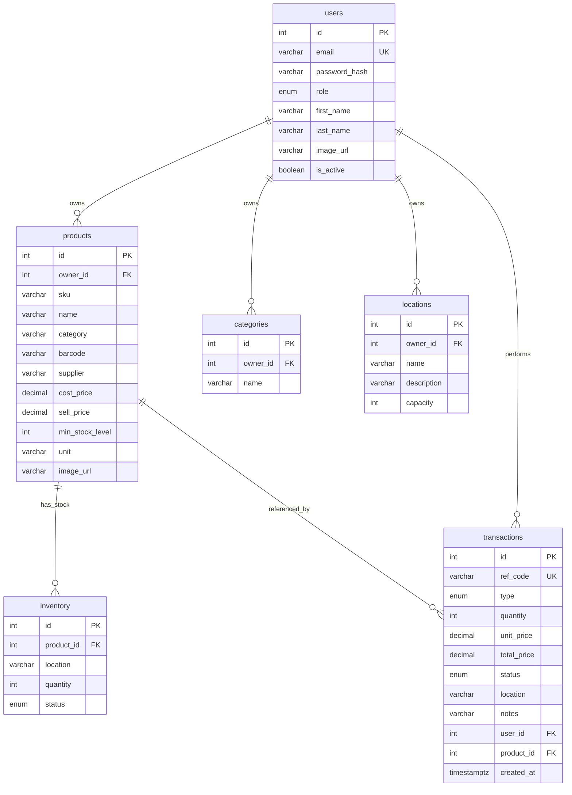

# OptiTrack WMS - Database Schema

This document describes the database structure currently implemented in the FastAPI backend under `backend/app/models/` and the related business rules enforced by the route layer.

## Database Engine

- **Production database:** PostgreSQL via `postgresql+asyncpg`
- **ORM:** SQLAlchemy 2.0 async
- **Session pattern:** request-scoped `AsyncSession` from `app/core/database.py`
- **Schema bootstrap:** `python -m scripts.init_db` or `INIT_DB_ON_STARTUP=True` in development
- **Test database:** SQLite with `aiosqlite`

## Entity Relationship Diagram

## Multi-Tenant Ownership Model

OptiTrack isolates warehouse data by authenticated user.

- **Direct ownership:** `products.owner_id`, `categories.owner_id`, and `locations.owner_id` reference `users.id`.
- **Transaction ownership:** `transactions.user_id` references `users.id`.
- **Inventory ownership:** `inventory` does not store `owner_id`; ownership is enforced through `inventory.product_id -> products.owner_id`.

Every user-owned query must filter by the current authenticated user, either directly through `owner_id` / `user_id` or through a join to `products`.

## Tables

### `users`

Stores authentication, role, and profile data.

| Column | Type | Constraints | Description |
|---|---|---|---|
| `id` | `INTEGER` | Primary key, autoincrement, indexed | Internal user ID |
| `email` | `VARCHAR(255)` | Unique, indexed, not null | Login email |
| `password_hash` | `VARCHAR(255)` | Not null | Bcrypt password hash |
| `role` | `ENUM(UserRole)` | Not null, default `ADMIN` | Current active application role is `ADMIN` |
| `first_name` | `VARCHAR(100)` | Not null | Profile first name |
| `last_name` | `VARCHAR(100)` | Not null | Profile last name |
| `image_url` | `VARCHAR(500)` | Nullable | Profile image URL or local `/uploads/...` path |
| `is_active` | `BOOLEAN` | Not null, default `TRUE` | Account active flag |

#### Relationships

- **Products:** one-to-many with cascade delete
- **Categories:** one-to-many with cascade delete
- **Locations:** one-to-many with cascade delete
- **Transactions:** one-to-many without cascade delete configured on the ORM relationship

### `products`

Stores product master data, pricing, categorization, and optional product image URL.

| Column | Type | Constraints | Description |
|---|---|---|---|
| `id` | `INTEGER` | Primary key, autoincrement, indexed | Internal product ID |
| `owner_id` | `INTEGER` | FK to `users.id`, indexed, not null | Tenant/user owner |
| `sku` | `VARCHAR(100)` | Indexed, not null | Stock keeping unit |
| `name` | `VARCHAR(255)` | Not null | Product name |
| `category` | `VARCHAR(100)` | Nullable | Category name snapshot/text |
| `barcode` | `VARCHAR(100)` | Indexed, nullable | Optional barcode |
| `supplier` | `VARCHAR(255)` | Nullable | Supplier name |
| `cost_price` | `NUMERIC(10, 2)` | Not null | Purchase cost |
| `sell_price` | `NUMERIC(10, 2)` | Not null | Selling price |
| `min_stock_level` | `INTEGER` | Not null, default `0` | Low-stock threshold |
| `unit` | `VARCHAR(50)` | Default `pcs` | Unit of measure |
| `image_url` | `VARCHAR(500)` | Nullable | Product image URL |

#### Application-Level Rules

- **Per-owner SKU uniqueness:** enforced in route logic, not as a database unique constraint.
- **Price validation:** `sell_price` must be greater than or equal to `cost_price`.
- **Admin-only writes:** product update and delete use admin authorization.
- **Cascade behavior:** deleting a product cascades to related `inventory` and `transactions` rows.

### `categories`

Stores reusable category names for each user.

| Column | Type | Constraints | Description |
|---|---|---|---|
| `id` | `INTEGER` | Primary key, autoincrement, indexed | Internal category ID |
| `owner_id` | `INTEGER` | FK to `users.id`, indexed, not null | Tenant/user owner |
| `name` | `VARCHAR(100)` | Indexed, not null | Category name |

#### Application-Level Rules

- **Per-owner uniqueness:** category names are unique per owner in route logic.
- **Admin-only writes:** create, update, and delete require admin authorization.
- **No category FK:** products store `category` as text; there is no FK from `products.category` to `categories.name`.

### `locations`

Stores valid warehouse locations for each user and their storage capacity.

| Column | Type | Constraints | Description |
|---|---|---|---|
| `id` | `INTEGER` | Primary key, autoincrement, indexed | Internal location ID |
| `owner_id` | `INTEGER` | FK to `users.id`, indexed, not null | Tenant/user owner |
| `name` | `VARCHAR(50)` | Indexed, not null | Location name |
| `description` | `VARCHAR(255)` | Nullable | Human-readable description |
| `capacity` | `INTEGER` | Not null, default `0` | Maximum total quantity allowed at this location |

#### Application-Level Rules

- **Per-owner uniqueness:** location names are unique per owner in route logic.
- **Name-based reference:** inventory and transactions reference locations by location name, not by `location_id`.
- **Rename propagation:** renaming a location updates matching `inventory.location` rows and `transactions.location` rows for the same user.
- **Capacity protection:** capacity cannot be reduced below the current stock quantity at that location.
- **Delete protection:** a location cannot be deleted if inventory or transaction history still references it.

### `inventory`

Stores current stock for a product at a location.

| Column | Type | Constraints | Description |
|---|---|---|---|
| `id` | `INTEGER` | Primary key, autoincrement, indexed | Internal inventory row ID |
| `product_id` | `INTEGER` | FK to `products.id` with `ON DELETE CASCADE`, not null | Product reference |
| `location` | `VARCHAR(50)` | Indexed, not null | Warehouse location name |
| `quantity` | `INTEGER` | Not null, default `0` | Current stock quantity |
| `status` | `ENUM(InventoryStatus)` | Not null, default `IN_STOCK` | `IN_STOCK`, `LOW_STOCK`, or `OUT_OF_STOCK` |

#### Database Constraints

| Constraint | Columns | Description |
|---|---|---|
| `uix_product_location` | `product_id`, `location` | One stock row per product per location |

#### Application-Level Rules

- **Product ownership:** the referenced product must belong to the current user.
- **Location validation:** the referenced location name must exist for the current user.
- **Capacity validation:** creating inventory checks projected location stock against `locations.capacity`.
- **Owner isolation:** inventory ownership is enforced by joining through `products.owner_id`.

### `transactions`

Stores inventory movement history and financial snapshots.

| Column | Type | Constraints | Description |
|---|---|---|---|
| `id` | `INTEGER` | Primary key, autoincrement, indexed | Internal transaction ID |
| `ref_code` | `VARCHAR(100)` | Unique, indexed, not null | Generated reference code |
| `type` | `ENUM(TransactionType)` | Indexed, not null | `INBOUND`, `OUTBOUND`, or `ADJUST` |
| `quantity` | `INTEGER` | Not null | Movement quantity |
| `unit_price` | `NUMERIC(10, 2)` | Not null | Price snapshot used for the transaction |
| `total_price` | `NUMERIC(12, 2)` | Not null | `unit_price * quantity` |
| `status` | `ENUM(TransactionStatus)` | Not null, default `COMPLETED` | `PENDING`, `COMPLETED`, or `CANCELLED` |
| `location` | `VARCHAR(50)` | Nullable | Location name |
| `notes` | `VARCHAR(500)` | Nullable | User notes |
| `user_id` | `INTEGER` | FK to `users.id`, indexed, not null | User who created the transaction |
| `product_id` | `INTEGER` | FK to `products.id` with `ON DELETE CASCADE`, indexed, not null | Product reference |
| `created_at` | `TIMESTAMP WITH TIME ZONE` | Indexed, not null, server default `NOW()` | Creation timestamp |

#### Transaction Processing Rules

| Type | Inventory Effect | Unit Price Source | Capacity Check |
|---|---|---|---|
| `INBOUND` | Adds quantity to stock | `products.cost_price` | Checks projected location quantity |
| `OUTBOUND` | Subtracts quantity from stock | `products.sell_price` | No capacity increase check; validates sufficient stock |
| `ADJUST` | Sets product-location stock to the provided quantity | `products.cost_price` | Checks projected location quantity after replacement |

Additional rules:

- **Product ownership:** transaction product must belong to the current user.
- **Location validation:** transaction location must exist for the current user.
- **Outbound stock:** `OUTBOUND` requires an existing inventory row and sufficient quantity.
- **Inventory creation:** `INBOUND` or `ADJUST` creates the inventory row if it does not exist.
- **Frontend preview:** the transaction modal may preview current stock, inbound projected stock, outbound items left, and outbound shortage warnings before submit.
- **Backend authority:** database updates and transaction validation are finalized by the backend route; the frontend preview does not replace server-side validation.
- **Status:** new transactions are stored with status `COMPLETED`.
- **Date override:** `created_at` can be supplied by the client; otherwise the database default is used.

## Enumerations

### `UserRole`

Current application authorization is admin-centric.

| Value | Current Usage |
|---|---|
| `ADMIN` | Active role assigned by the current signup UI and required by `get_current_admin_user` for protected write routes |

Implementation note:

- **Legacy enum compatibility:** the backend model/schema and frontend shared type still contain non-admin enum values for backward compatibility, but the current frontend signup UI creates users as `ADMIN` and does not expose a role selector.

### `InventoryStatus`

| Value | Meaning |
|---|---|
| `IN_STOCK` | Quantity is at or above the product minimum stock level |
| `LOW_STOCK` | Quantity is below the product minimum stock level but greater than zero |
| `OUT_OF_STOCK` | Quantity is zero |

### `TransactionType`

| Value | Meaning |
|---|---|
| `INBOUND` | Stock received into a location |
| `OUTBOUND` | Stock shipped/sold out of a location |
| `ADJUST` | Manual correction to the exact stock quantity |

### `TransactionStatus`

| Value | Meaning |
|---|---|
| `PENDING` | Defined enum value; current create route stores completed transactions |
| `COMPLETED` | Default transaction state |
| `CANCELLED` | Defined enum value for workflow support |

## Stock Status Calculation

The backend calculates inventory status from product threshold and current quantity:

| Condition | Status |
|---|---|
| `quantity == 0` | `OUT_OF_STOCK` |
| `0 < quantity < min_stock_level` | `LOW_STOCK` |
| `quantity >= min_stock_level` | `IN_STOCK` |

## Financial Data Rules

- **Decimal storage:** product prices are stored as `NUMERIC`/`Decimal`.
- **Non-negative prices:** `cost_price` and `sell_price` must be non-negative.
- **Margin validation:** product creation and update validation prevents `sell_price < cost_price`.
- **Transaction snapshots:** each transaction stores immutable `unit_price` and `total_price`.
- **Analytics:** dashboard sales/cost/profit metrics are computed from transaction and product data.

## Capacity Rules

Locations have a total capacity measured as aggregate stock quantity across all inventory rows for that location and owner.

- **Inventory creation:** `current_location_quantity + new_quantity <= capacity`
- **Inbound transaction:** `current_location_quantity + inbound_quantity <= capacity`
- **Adjust transaction:** `current_location_quantity - existing_product_location_quantity + adjusted_quantity <= capacity`
- **Location update:** new capacity must be greater than or equal to current stock

## Profile Image and Object Storage Data

Profile images are not stored as database blobs.

- **Database field:** `users.image_url` stores the resulting URL/path.
- **Local storage path:** `/uploads/profiles/<uuid>.<ext>`
- **S3/MinIO URL:** public object URL based on `S3_PUBLIC_URL_BASE`, `S3_ENDPOINT_URL`, or AWS S3 URL construction.
- **Supported MIME types:** `image/jpeg`, `image/png`, `image/webp`, `image/gif`
- **Max upload size:** controlled by `S3_MAX_UPLOAD_BYTES`, defaulting to 5 MB

## Dashboard Queries

The dashboard uses existing tables instead of dedicated aggregate tables.

| Metric | Source |
|---|---|
| Total products | `products`, optionally joined to `inventory` by selected location |
| Inventory value | `inventory.quantity * products.cost_price` |
| Low stock count | `inventory.status == LOW_STOCK` |
| Transactions today | `transactions.created_at >= current UTC day start` |
| Sales chart | `OUTBOUND` transactions grouped by date |
| Storage health | `sum(inventory.quantity) / sum(locations.capacity)` |

## Indexes and Constraints Summary

| Table | Indexed / constrained columns |
|---|---|
| `users` | `id`, `email` unique |
| `products` | `id`, `owner_id`, `sku`, `barcode` |
| `categories` | `id`, `owner_id`, `name` |
| `locations` | `id`, `owner_id`, `name` |
| `inventory` | `id`, `location`, unique `product_id + location` |
| `transactions` | `id`, `ref_code` unique, `type`, `user_id`, `product_id`, `created_at` |

## Important Implementation Notes

- **No separate tenant table:** the authenticated user is the tenant boundary.
- **No direct location FK:** inventory and transactions store `location` as text.
- **No category FK:** products store `category` as text.
- **Per-owner uniqueness:** SKU, category name, and location name uniqueness are enforced by route logic.
- **Stock previews are not persisted:** inbound/outbound "items after" and "items left" values are computed in the frontend from current inventory data.
- **Docker bootstrap:** `db-init` runs `python -m scripts.init_db` before the API starts.
- **Compatibility bootstrap:** schema init adds `locations.capacity` if an existing table is missing that column.
